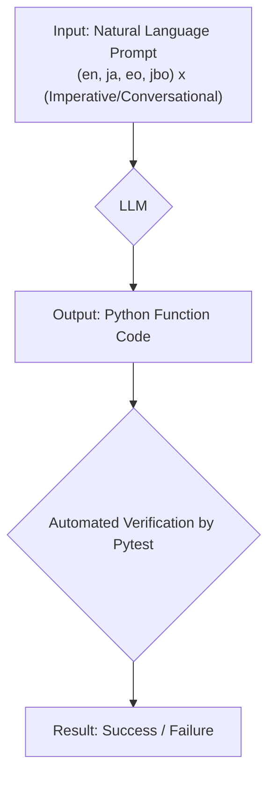
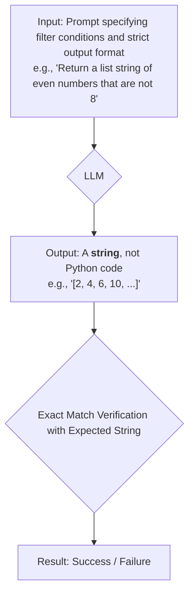
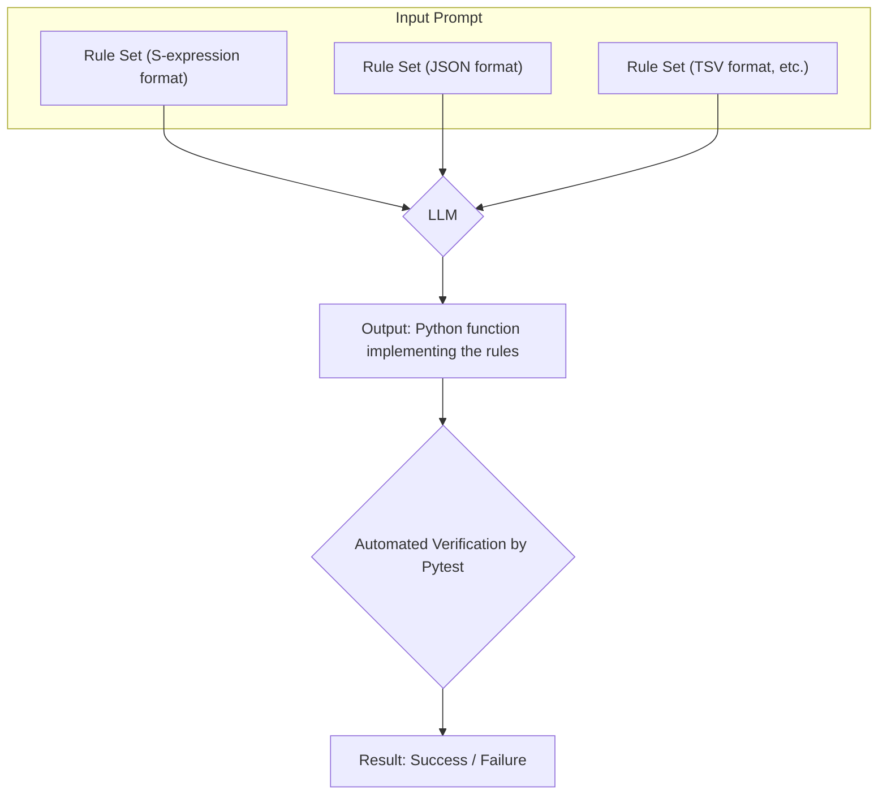
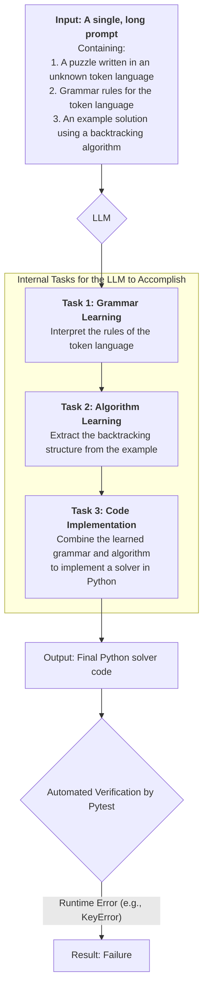

# Benchmarking Large Language Models Against Prompt Formats: Experimental Methods and Results

## 1. Introduction

While Large Language Models (LLMs) are being utilized in various fields for their remarkable capabilities (Zhao, W. X., et al., 2023), their performance is known to suffer from the problem of **Prompt Sensitivity**, where performance heavily depends on the design of the prompt. Furthermore, existing benchmarks like the Hugging Face Open LLM Leaderboard face the issue of **"Data Contamination,"** where evaluation data is included in the training data, raising concerns that models may simply be "memorizing" answers rather than demonstrating true reasoning abilities. These challenges highlight the difficulty of measuring the true capabilities of LLMs, especially their generalization performance on unseen problems.

To answer the question "Why is this benchmark necessary now?" this study proposes a new evaluation axis that, in principle, eliminates the possibility of data contamination. Specifically, the constructed language Lojban is used, as it is highly unlikely to be in the training data. Additionally, **Symbolic Prompting**—the use of unambiguous formats like S-expressions and JSON to represent logic—was designed for this research. This approach, unlike existing **symbolic reasoning benchmarks**, aims to measure the true reasoning and adaptation capabilities for unknown formal languages by eliminating dependence on the model's memory.

The lack of replicability in prompt engineering techniques is a serious issue (Vaugrante, et al., 2025). On the other hand, it has been shown that prompt clarity directly leads to improved human productivity (Anam, 2025), and the need for guidelines in fields requiring rigor, such as requirements engineering, has also been indicated (Ronanki, et al., 2025). These points suggest that research which systematically and reproducibly evaluates the impact of prompt format on model responses is of extremely high importance both academically and practically. Additionally, the fragility of methods like Chain-of-Thought has been pointed out (Trivedi, et al., 2023), and there is a demand for a reliable dataset on how factors like the language, style, and syntactic format of a prompt affect model responses.

The purpose of this paper is to provide, as an objective technical document, the results of benchmark experiments that systematically evaluated LLM responses to different prompt formats. The experiments reported in this paper are broadly categorized as follows:

*   **Simple Code Generation Tasks**: Evaluate the impact of prompt language and style on the success rate of basic code generation tasks using diverse natural languages such as English, Japanese, and Esperanto, in addition to Lojban. Lojban is a logical language that completely eliminates syntactic ambiguity, possessing unique characteristics that place it between common natural languages and formal symbolic languages. This property is leveraged to test whether models are merely memorizing superficial language patterns or abstractly understanding the underlying logical structure.
*   **Logical Reasoning Tasks**: Evaluate the model's ability on more complex tasks that include multiple logical constraints or ambiguous instructions. This includes tests that probe the ability to interpret and execute on-the-fly fully symbolic languages like S-expressions and JSON, as well as a token-based language designed for this study. This allows for the observation of how a model's capabilities change across the spectrum from ambiguous natural language to strict symbolic language.

The following sections detail the experimental environment, describe each experiment, and present a discussion of the results.

## 2. Experimental Environment

### 2.1. Setting up the Execution Environment

To reproduce this experimental package, it is recommended to set up a Python virtual environment following the procedure described in the attached `README.md`.

### 2.2. Evaluated Models and Inference Parameters

In this experiment, mainly lightweight (under 8B parameters) open-source language models accessible via Ollama were evaluated. The models used and their details, as well as the hyperparameters at the time of inference, are summarized in the table below.

**Table 1: Evaluated Models and Inference Hyperparameters**

| Model Name (Ollama) | Parameters | Quantization (Est.)* | Temperature | Top P | Seed |
|:---|:---:|:---:|:---:|:---:|:---:|
| `gemma3:270m` | 0.27B | Q4_K_M | 0.0 | 1.0 | 0 |
| `smollm:360m` | 0.36B | Q4_K_M | 0.0 | 1.0 | 0 |
| `qwen:0.5b` | 0.5B | Q4_K_M | 0.0 | 1.0 | 0 |
| `tinyllama:1.1b` | 1.1B | Q4_K_M | 0.0 | 1.0 | 0 |
| `deepseek-r1:1.5b`| 1.5B | Unknown | 0.0 | 1.0 | 0 |
| `stablelm2:1.6b` | 1.6B | Q4_K_M | 0.0 | 1.0 | 0 |
| `qwen:1.8b` | 1.8B | Q4_K_M | 0.0 | 1.0 | 0 |
| `gemma:2b` | 2B | Q4_K_M | 0.0 | 1.0 | 0 |
| `falcon3:3b` | 3B | Unknown | 0.0 | 1.0 | 0 |
| `llama3.2:3b` | 3.2B | Unknown | 0.0 | 1.0 | 0 |
| `phi3:mini` | 3.8B | Q4_K_M | 0.0 | 1.0 | 0 |
| `gemma3:4b` | 4B | Q4_K_M | 0.0 | 1.0 | 0 |
| `qwen:4b` | 4B | Q4_K_M | 0.0 | 1.0 | 0 |
| `yi:6b` | 6B | Q4_K_M | 0.0 | 1.0 | 0 |
| `gemma:7b` | 7B | Q4_K_M | 0.0 | 1.0 | 0 |
| `mistral:7b` | 7B | Q4_K_M | 0.0 | 1.0 | 0 |
| `llama2:7b` | 7B | Q4_K_M | 0.0 | 1.0 | 0 |
| `deepseek-llm:7b` | 7B | Q4_K_M | 0.0 | 1.0 | 0 |
| `deepseek-r1:8b` | 8B | Unknown | 0.0 | 1.0 | 0 |
| `llama3:8b` | 8B | Q4_K_M | 0.0 | 1.0 | 0 |

*\*Note: Quantization details depend on the Ollama library; some models are presumed to use the common `Q4_K_M`. Details for some models are listed as 'Unknown' as they are not specified in the model card provided by the Ollama repository.*

To ensure deterministic reproducibility of the experiments, the inference hyperparameters were unified to `temperature: 0.0`, `top_p: 1.0`, and `seed: 0` for all experiments. This was intended to minimize stochastic fluctuations in model responses and to evaluate the impact of the prompt format itself.

### 2.3. Evaluation Criteria

This benchmark defines the following success criteria depending on the task type.

**Code Generation Tasks**: Success is defined as the generated Python code passing all predefined unit tests (Pytest) **without any modification**. Each task is attempted only once, and the success rate is used for evaluation, making this a strict evaluation criterion equivalent to **Pass@1**.

**String Generation Task** (`filtered_list`): Success is defined as the list-formatted string requested by the prompt perfectly matching the expected output at the character level. This evaluates the ability to follow instructions and adhere to a format directly, rather than generating code.

**Logical Reasoning Tasks**:
*   **Implementation Correctness**: Success is defined as the generated code correctly implementing the given logic (from S-expressions, JSON, custom token language, etc.) and passing all associated unit tests.
*   **Qualitative Analysis of Thought Process**: For tasks requiring Chain-of-Thought, the generated thought process is qualitatively analyzed for faithfulness to the rules, lack of contradictions, and its influence on the final answer, serving as material for discussion.

## 3. Overview of Experimental Design

This benchmark consists of various tasks, from simple code generation to complex logical reasoning. The details of each task are described in the attached `README.md`. Particularly noteworthy are the `Filtered List` test and the `Einstein Riddle - token_test`. As these tests initially had a 0% success rate for many models, the evaluation scripts and prompts were incrementally improved during the composition of this paper. This improvement process itself provided important insights into the capabilities and limitations of LLMs.

### 3.1. Conceptual Diagrams of Each Test

Below are conceptual flow diagrams of the main tests included in this benchmark.

**Figure 1: Simple Code Generation Task (`simple_sort`, etc.)**

This task group evaluates the ability to generate a corresponding Python function based on basic instructions.



**Figure 2: `filtered_list` Task**

This test evaluates the ability not just to generate code, but to follow complex logical instructions and adhere to a strict output format.



**Figure 3: `diagnosis` / `einstein` Tasks (Symbolic Language)**

These tasks evaluate the ability to interpret rules described in unambiguous symbolic languages like S-expressions or JSON and generate Python code to execute them.



**Figure 4: `einstein_token_test` Task**

The most complex task in this benchmark. It simultaneously evaluates three different abilities: learning an unknown language, learning an algorithm, and bug-free implementation.



## 4. Results

Detailed success rate data from a large-scale benchmark experiment with 30 runs for each test are presented in Appendix A. This section summarizes the main trends. First, instructions in natural languages like English and Japanese showed consistently high success rates for many models, but performance dropped significantly for the logical language Lojban. Second, while an increase in model parameter size contributed to performance improvement in simple code generation tasks, it did not necessarily correlate with the success rate of more complex tasks designed in this study, such as interpreting and executing an unknown symbolic language.

## 5. Detailed Analysis and Discussion

This chapter discusses how each experimental result supports the hypothesis that the capabilities of LLMs depend on pattern matching rather than abstract reasoning.

### 5.1. The Effect of Prompt Strictness in the `Filtered List` Test

The `Filtered List` test initially had a 0% success rate for many models. The cause was that, in response to the instruction "return a list," the models would return "Python code that generates a list" instead of the list itself, due to biases in their training data.

To address this issue, a strict output format instruction was added to the prompt: "Return only the list string, not a program code." As a result, performance improved dramatically, with many models, including `deepseek-r1:8b` and `llama3:8b`, showing consistently high success rates, especially in English (`en`) and Japanese (`ja`). This suggests that the explicit specification of the output format in a prompt is extremely important for eliciting and correctly evaluating the latent abilities of a model. Furthermore, within the scope of this experiment, the style of the prompt (imperative vs. conversational) was not observed to have a statistically significant effect on the success rate of code generation.

On the other hand, in Lojban (`jbo`), all models still failed even after the prompt was modified. This result is particularly insightful considering Lojban's role as a language with properties intermediate between symbolic and natural languages. Given that some models succeed in other code generation tasks with Lojban, it is possible that the models are learning a kind of **superficial translation pattern**, such as "from Lojban syntax to Python syntax." However, the task of "interpreting the logic of Lojban and outputting the result as a Python data structure (a list string)," which requires a deeper semantic understanding, was unachievable. This suggests that models may be processing Lojban not as an unambiguous instruction set, but merely as a sequence of tokens.

This asymmetry in language understanding is structurally consistent with the phenomenon known as the "Reversal Curse," where LLMs trained on "A is B" fail to infer "B is A" (Berglund, et al., 2023). The experiment demonstrates from a different angle that the "Reversal Curse" is not limited to the simple reversal of factual relationships but is a broader problem of asymmetry between language understanding and logical execution.

Furthermore, an approach has been proposed to address this challenge by having the LLM generate Python code and entrusting its execution to an external deterministic computation engine (Gao, et al., 2022). The `Filtered List` test can be said to have highlighted the vulnerability of the LLM's own "internal execution engine," indirectly indicating the importance of these hybrid approaches.

### 5.2. Analysis of Phased Failure in `Einstein Riddle (token_test)`

The `Einstein Riddle - token_test` was designed as the most difficult task in this benchmark and, as a result, no model achieved final success. However, the incremental improvement process leading to this failure provided a high-resolution analysis of the limits of model capabilities.

1.  **Phase 1 (No Rules)**: Initially, when given only the puzzle described in an unknown token language, no model could understand the task at all.
2.  **Phase 2 (Grammar Rules Added)**: When the grammar specification for the token language was added to the prompt, even lightweight models like `phi3:mini` attempted to generate Python code to solve the puzzle. However, the generated code contained syntax errors (`SyntaxError`) and failed before execution.
3.  **Phase 3 (Few-Shot Prompting)**: Furthermore, a simple example problem and a model solution code using an efficient "backtracking" algorithm were added to the prompt. This enabled `llama3:8b` to mimic the structure of backtracking and generate syntactically correct code.
4.  **Final Phase (Runtime Error)**: However, the code generated by `llama3:8b` contained a bug in the algorithm's logic (an error in state management during recursion), causing a `KeyError` or a timeout during execution.

This process showed that state-of-the-art LLMs (8B class) can, with appropriate guidance, accomplish advanced tasks such as "interpreting an unknown language," "selecting an appropriate algorithm," and "generating syntactically correct code." On the other hand, it clearly shows that they have not yet overcome the final hurdle of "**stably implementing a bug-free complex algorithm**." This "failure at the final stage of implementation" is in line with the observation that LLMs systematically fail at the compositional manipulation of knowledge (Pan, et al., 2024). This test suggests that even if a model can imitate individual elements (grammar, algorithmic structure), its ability to combine them correctly to build a coherent logical system is limited. This test served as an indicator not only of the model's logical reasoning ability but also of the limits of its capabilities at a deeper level—the correctness of algorithmic implementation.

In response to the limitations of LLMs in complex problem-solving, as demonstrated by the `token_test`, the academic community has proposed new reasoning architectures that extend Chain-of-Thought to tree or graph structures, enabling search and self-evaluation (Yao, et al., 2023; Besta, et al., 2023). The results of this study suggest the importance of these approaches.

#### 5.2.1. Qualitative Analysis of Failed Code

To further analyze the cause of failure in the code generated by `llama3:8b`, a schematic excerpt of typical failed code is shown below.

```python
# Schematic excerpt of code generated by llama3:8b
def solve_puzzle(rules, assignments):
    if is_complete(assignments):
        return assignments

    var = select_unassigned_variable(assignments)
    for value in domain_values(var):
        # ★ Fatal Flaw
        # The assignments dictionary is modified directly without copying,
        # leaking the current hypothesis to subsequent search branches.
        assignments[var] = value 
        if is_consistent(assignments, rules):
            result = solve_puzzle(rules, assignments)
            if result is not None:
                return result
    
    # The process to clear the failed hypothesis is missing.
    # A backtracking step like `assignments[var] = None` is essential here.
    return None
```

The fatal flaw in this code is that during the recursive call, the current solution hypothesis (`assignments`) is passed to the next search branch **without being copied**. In a backtracking algorithm, each search path must be independent. However, in this code, the assignment of a value to a variable in one search branch is not cleared after the branch fails and returns, thus affecting other search branches.

As a result, constraints that should be unrelated interfere with each other, leading to a contradictory state (e.g., trying to access an already solved variable again). This is the root cause of the observed `KeyError` or timeout due to an infinite loop.

This failure demonstrates that while the model can imitate the **structural template of a backtracking algorithm (a for-loop and a recursive call)**, it fails to understand and implement the essential requirement for the algorithm to function correctly: **ensuring the independence of states**. This is a concrete example of the "systematic failure of compositional manipulation" pointed out by Pan, et al. (2024), and serves as strong evidence that LLMs remain at the level of superficial pattern matching and have not grasped the logical essence of the algorithm.

#### 5.2.2. Qualitative Analysis of Chain-of-Thought (CoT) Prompts

While CoT prompts led to correct answers for some models, there were also many cases of failure. An analysis of a failure case by `llama3.2:3b` with a Japanese CoT prompt reveals the fragility of the model's reasoning process.

**Failed Thought Process (Excerpt/Summary from `llama3.2:3b`'s CoT):**

1.  `...The Englishman lives in the red house.` (Rule 1)
2.  `...The Swede keeps dogs as pets.` (Rule 2)
3.  `...The green house is on the left of the white house.` (Rule 4)
4.  `...The resident of the green house drinks coffee.` (Rule 5)
5.  `...Assume the fourth house is green.` (**First erroneous assumption**)
6.  `...Then, the fifth house is the white house.` (Applying Rule 4)
7.  `...The resident of the fifth house drinks milk.` (Hint: The resident of the middle house drinks milk -> should be the 3rd house) -> **Generates information contradicting a rule here**
8.  `...The Norwegian lives in the first house.` (Rule 10)
9.  `...The first house is next to the blue house.` (Rule 15) -> `...Therefore, the second house is blue.`
10. `...The resident of the second house keeps horses.` (Rule 11)

In this process, the model attempts to apply individual rules, but along the way, it makes a fatally incorrect assumption that "the fourth house is green." Furthermore, as it proceeds with its reasoning from that assumption, it ignores the crucial hint that "the resident of the middle (third) house drinks milk" and derives a contradictory conclusion that milk is drunk in the "fifth house." This shows that CoT does not necessarily guarantee global constraint satisfaction and can be confined to local rule applications, being unable to detect or correct contradictions that arise midway.

### 5.3. On the Effectiveness of Symbolic Prompting

In the `diagnosis` and `einstein` tasks, prompts using symbolic languages like S-expressions and JSON showed higher success rates for some models than natural language. This result suggests several computational advantages of symbolic prompting.

*   **Syntactic Unambiguity**: In S-expressions and JSON, the syntax tree is uniquely determined by parentheses and brackets. In contrast to the ambiguous grammar of natural language, the model can structurally grasp the relationships between rules without getting lost in interpretation. This is thought to reduce the overhead of interpretation in the model's internal computations.
*   **Token Efficiency**: When expressing complex logical relationships, symbolic languages can sometimes compress information into fewer tokens than natural language. For example, the natural language expression "A and B, or C" can be more concisely represented by an S-expression like ` (or (and A B) C) `. Improved token efficiency allows more information to be processed within a limited context window, which can contribute to improved model performance.

While these formats are not always superior, it was shown that for problems with a clear logical structure, they can function as an effective interface that eliminates ambiguity and increases computational efficiency.

### 5.4. Multi-faceted Ranking Analysis

This section analyzes the overall performance of the models based on the results of a large-scale experiment with 30 trials for each test. The detailed results of the experiment are left to Appendix A; this section presents the main trends and the overall ranking.

The results of the large-scale experiment more strongly supported the initial hypothesis: **LLM performance is highest with simple natural language (especially English) but drops markedly for formally unambiguous languages like Lojban**. Also, as the overall ranking below shows, it was reconfirmed that **model size and overall logical reasoning ability do not necessarily correlate**. This suggests that the current capabilities of LLMs are heavily dependent on their fit to specific patterns in the training data.

**Table 2: Overall Performance Ranking**

Shows the average success rate of each model across all tests. This serves as a basic indicator of overall task execution ability.

| Model              |   Overall Success Rate |
|:-----------------|-----------:|
| yi:6b            |    74.42% |
| gemma3:4b        |    73.75% |
| llama3.2:3b      |    70.42% |
| falcon3:3b       |    70.00% |
| gemma:7b         |    70.00% |
| deepseek-r1:8b   |    68.17% |
| llama3:8b        |    67.42% |
| mistral:7b       |    52.50% |
| llama2:7b        |    45.00% |
| deepseek-r1:1.5b |    40.00% |
| deepseek-llm:7b  |    35.00% |
| stablelm2:1.6b   |    33.17% |
| smollm:360m      |    32.50% |
| gemma:2b         |    30.00% |
| gemma3:270m      |    27.50% |
| tinyllama:1.1b   |    15.00% |
| qwen:4b          |    12.50% |
| phi3:mini        |     7.50% |
| qwen:1.8b        |     5.08% |
| qwen:0.5b        |     5.00% |

The large-scale experiment showed `yi:6b` and `gemma3:4b` performing at the top with a narrow margin. Overall, the result supports the initial analysis that there is not necessarily a clear positive correlation between model size and performance.

```vega-lite
{
  "$schema": "https://vega.github.io/schema/vega-lite/v5.json",
  "title": "Overall Performance Ranking",
  "height": 500,
  "data": {
    "values": [
      {"Model": "yi:6b", "Overall Success Rate": "74.42%"},
      {"Model": "gemma3:4b", "Overall Success Rate": "73.75%"},
      {"Model": "llama3.2:3b", "Overall Success Rate": "70.42%"},
      {"Model": "falcon3:3b", "Overall Success Rate": "70.00%"},
      {"Model": "gemma:7b", "Overall Success Rate": "70.00%"},
      {"Model": "deepseek-r1:8b", "Overall Success Rate": "68.17%"},
      {"Model": "llama3:8b", "Overall Success Rate": "67.42%"},
      {"Model": "mistral:7b", "Overall Success Rate": "52.50%"},
      {"Model": "llama2:7b", "Overall Success Rate": "45.00%"},
      {"Model": "deepseek-r1:1.5b", "Overall Success Rate": "40.00%"},
      {"Model": "deepseek-llm:7b", "Overall Success Rate": "35.00%"},
      {"Model": "stablelm2:1.6b", "Overall Success Rate": "33.17%"},
      {"Model": "smollm:360m", "Overall Success Rate": "32.50%"},
      {"Model": "gemma:2b", "Overall Success Rate": "30.00%"},
      {"Model": "gemma3:270m", "Overall Success Rate": "27.50%"},
      {"Model": "tinyllama:1.1b", "Overall Success Rate": "15.00%"},
      {"Model": "qwen:4b", "Overall Success Rate": "12.50%"},
      {"Model": "phi3:mini", "Overall Success Rate": "7.50%"},
      {"Model": "qwen:1.8b", "Overall Success Rate": "5.08%"},
      {"Model": "qwen:0.5b", "Overall Success Rate": "5.00%"}
    ]
  },
  "transform": [
    {"calculate": "toNumber(replace(datum['Overall Success Rate'], '%', '')) / 100", "as": "SuccessRate"}
  ],
  "mark": "bar",
  "encoding": {
    "y": {
      "field": "Model",
      "type": "nominal",
      "title": "Model",
      "sort": {"op": "sum", "field": "SuccessRate", "order": "descending"}
    },
    "x": {
      "field": "SuccessRate",
      "type": "quantitative",
      "axis": {"format": "%"},
      "title": "Overall Success Rate"
    },
    "tooltip": [
      {"field": "Model", "type": "nominal", "title": "Model"},
      {"field": "SuccessRate", "type": "quantitative", "format": ".2%"}
    ]
  }
}
```
**Figure 5: Overall Performance Ranking.** Average success rate across all tasks based on the large-scale experiment.

#### 5.4.2. Qualitative Analysis of Lojban Tasks: Reasoning or Transpilation?

In this benchmark, the logical language Lojban consistently showed low performance. To delve deeper into the cause, additional experiments were conducted, including basic translation tasks (e.g., translating "`lo gerku cu sutra`" to "the dog is fast") and simple code generation. The results were decisive: **all 20 evaluated models failed on all 7 of these basic tasks**.

This result clearly indicates that the few limited successes seen in the main benchmark were not "reasoning" based on an understanding of Lojban's logical structure, but merely a superficial "transpilation" of patterns accidentally present in the training data, such as "specific Lojban syntax ⇔ specific Python code." The models were unable to use Lojban's syntactic unambiguity as a foothold for logical reasoning, instead treating it as an unknown sequence of tokens with scarce training data, failing to arrive at a semantic understanding. This phenomenon is strong evidence that the language understanding of LLMs remains within the scope of statistical pattern recognition.

Furthermore, it is hypothesized that this failure may occur at the tokenizer level. A language like Lojban, while using Latin characters, has a completely different morphological analysis (word segmentation) from English and other Latin-based languages. For example, words like `fancu` (function), `namcu` (number), and `liste` (list) are likely to be split into multiple tokens, such as `fa` and `ncu`, by a standard BPE (Byte-Pair Encoding) tokenizer, rather than being treated as meaningful units. It is hypothesized that such inefficient tokenization makes it significantly difficult for the model to learn word-level semantic patterns, which in turn can be a fundamental cause hindering the understanding of higher-order syntax and logical structures.

## 6. Conclusion and Future Work

This study has several limitations. First, it is limited to open-source lightweight models (under 8B parameters) and does not include larger, closed-source models like GPT-4 or Claude 3. Second, the failures in complex tasks like `einstein_token_test` might be attributable to an insufficient context window length. Finally, generation parameters like `temperature` were fixed at `0.0`, and behavior under more stochastic settings has not been evaluated.

This paper presented the results of a series of benchmark experiments to evaluate the impact of prompt language, style, and syntactic format on LLM responses, particularly in code generation and logical reasoning.

The conclusions of this study are threefold. First, prompt strictness, especially the **explicit specification of the output format, is crucial for maximizing a model's performance**. As the `Filtered List` test shows, ambiguous instructions lead the model to be swayed by training data biases, whereas strict instructions can 'elicit' its latent capabilities. Second, while current LLMs can partially accomplish advanced tasks like interpreting the grammar of an unknown formal language or mimicking algorithmic structures, they have a very clear limitation in their ability to stably implement complex, bug-free algorithms from scratch. The failure of all models in the `token_test` strongly supports the idea that even if models can imitate superficial patterns, they have a systematic flaw in their ability to understand and implement the logical essence of an algorithm (e.g., state independence). Third, these results, particularly the staged failure on the `einstein_token_test`, provide empirical evidence supporting the "mirage" theory (Schaeffer, et al., 2023). Abilities that appear 'emergent' are perhaps better understood as latent capabilities 'elicited' by highly specific and structured prompts, rather than as generalizable reasoning skills.

Based on the findings of this study, three directions for future work are proposed:

1.  **Validation with Larger Models**: This study focused on lightweight models. Future work should conduct similar benchmarks on state-of-the-art large-scale models like the GPT-4 and Claude 3 families to comparatively analyze how model scale and architecture affect sensitivity to prompt formats and the limits of logical implementation ability.
2.  **Diversification of Algorithms**: The algorithm used in the `token_test` was limited to backtracking. By designing and adding tests that require different types of complex logic, such as dynamic programming or graph search algorithms, it will be possible to distinguish whether the observed failures are specific to a particular algorithm or represent a more general limitation in implementation capability.
3.  **Evaluation of Generation Parameter Impact**: This experiment was fixed with `temperature: 0.0`. Future work should explore deeper insights into the stochastic behavior of LLMs by evaluating the stability and diversity of outputs and their impact on task success rates when the temperature setting is varied.

It is hoped that the experimental environment and dataset provided in this paper will contribute to future research on evaluating the capabilities of LLMs and building more reliable AI systems.

## 7. Ethical Considerations

This study revealed the poor performance of LLMs on non-mainstream languages (Lojban, Esperanto). This suggests that the training data of current models is heavily biased towards mainstream languages like English. This bias highlights the risk of inadequate representation for non-mainstream languages and cultures. For future model development, the construction of more diverse and inclusive datasets is essential from an ethical standpoint.

## 8. References

Anam, M. (2025). *Prompt Engineering and the Effectiveness of Large Language Models in Enhancing Human Productivity*. arXiv preprint arXiv:2507.18638.

Berglund, L., et al. (2023). *The Reversal Curse: LLMs trained on "A is B" fail to learn "B is A"*. arXiv preprint arXiv:2309.12288.

Besta, M., et al. (2023). *Graph of Thoughts: Solving Elaborate Problems with Large Language Models*. arXiv preprint arXiv:2308.09687.

Gao, L., et al. (2022). *Program-Aided Language Models*. arXiv preprint arXiv:2211.10435.

Marcus, G. (2020). *The Next Decade in AI: Four Steps Towards Robust Artificial Intelligence*. arXiv preprint arXiv:2002.06177.

Pan, C., et al. (2024). *Why can't LLMs solve Multi-hop Reasoning Questions?*. arXiv preprint arXiv:2405.08341.

Ronanki, S., et al. (2025). *Prompt Engineering Guidelines for Using Large Language Models in Requirements Engineering*. arXiv preprint arXiv:2507.03405.

Schaeffer, R., et al. (2023). *Are Emergent Abilities of Large Language Models a Mirage?*. arXiv preprint arXiv:2304.15004.

Thomas, A. W., et al. (2023). *Unsolvable Problems for Large Language Models: A Formal Language Approach*. arXiv preprint arXiv:2310.16799.

Trivedi, H., et al. (2023). *The Fragility of Chain-of-Thought Reasoning*. arXiv preprint arXiv:2308.03761.

Vaugrante, L., et al. (2025). *Prompt Engineering Techniques for Language Model Reasoning Lack Replicability*. In *Transactions on Machine Learning Research*.

Wei, J., et al. (2022). *Chain-of-Thought Prompting Elicits Reasoning in Large Language Models*. In *Advances in Neural Information Processing Systems 35*.

Wei, J., et al. (2022). *Emergent Abilities of Large Language Models*. arXiv preprint arXiv:2206.07682.

Yao, S., et al. (2023). *Tree of Thoughts: Deliberate Problem Solving with Large Language Models*. arXiv preprint arXiv:2305.10601.

Zhao, W. X., et al. (2023). *A Survey of Large Language Models*. arXiv preprint arXiv:2303.18223.

# Appendix A: Detailed Experiment Results

Below is a summary of the number of successful trials from a large-scale experiment with 30 runs for each test.

# Experiment Results Summary

### Return One Success Rates
| Model / Language | ja | en | eo | jbo |
| :--- |  :---: | :---: | :---: | :---: |
| `gemma3:270m` | 0/30 | 0/30 | 0/30 | 0/30 |
| `smollm:360m` | 0/30 | 30/30 | 30/30 | 0/30 |
| `qwen:0.5b` | 0/30 | 30/30 | 0/30 | 0/30 |
| `tinyllama:1.1b` | 30/30 | 30/30 | 30/30 | 0/30 |
| `deepseek-r1:1.5b` | 30/30 | 30/30 | 30/30 | 0/30 |
| `stablelm2:1.6b` | 30/30 | 30/30 | 30/30 | 1/30 |
| `qwen:1.8b` | 30/30 | 30/30 | 0/30 | 1/30 |
| `gemma:2b` | 30/30 | 30/30 | 30/30 | 0/30 |
| `falcon3:3b` | 30/30 | 30/30 | 30/30 | 0/30 |
| `llama3.2:3b` | 30/30 | 30/30 | 30/30 | 30/30 |
| `phi3:mini` | 30/30 | 30/30 | 30/30 | 0/30 |
| `gemma3:4b` | 30/30 | 30/30 | 30/30 | 30/30 |
| `qwen:4b` | 30/30 | 30/30 | 30/30 | 0/30 |
| `yi:6b` | 30/30 | 30/30 | 30/30 | 30/30 |
| `gemma:7b` | 30/30 | 30/30 | 30/30 | 30/30 |
| `mistral:7b` | 30/30 | 30/30 | 30/30 | 30/30 |
| `llama2:7b` | 30/30 | 30/30 | 30/30 | 0/30 |
| `deepseek-llm:7b` | 30/30 | 30/30 | 30/30 | 0/30 |
| `deepseek-r1:8b` | 30/30 | 30/30 | 30/30 | 30/30 |
| `llama3:8b` | 29/30 | 30/30 | 30/30 | 30/30 |

### Copy List Success Rates
| Model / Language | ja | en | eo | jbo |
| :--- |  :---: | :---: | :---: | :---: |
| `gemma3:270m` | 30/30 | 30/30 | 0/30 | 0/30 |
| `smollm:360m` | 30/30 | 30/30 | 30/30 | 30/30 |
| `qwen:0.5b` | 0/30 | 0/30 | 0/30 | 0/30 |
| `tinyllama:1.1b` | 30/30 | 30/30 | 30/30 | 0/30 |
| `deepseek-r1:1.5b` | 30/30 | 30/30 | 0/30 | 0/30 |
| `stablelm2:1.6b` | 0/30 | 30/30 | 30/30 | 0/30 |
| `qwen:1.8b` | 0/30 | 0/30 | 0/30 | 0/30 |
| `gemma:2b` | 30/30 | 30/30 | 30/30 | 0/30 |
| `falcon3:3b` | 30/30 | 30/30 | 30/30 | 30/30 |
| `llama3.2:3b` | 30/30 | 30/30 | 30/30 | 30/30 |
| `phi3:mini` | 0/30 | 0/30 | 0/30 | 0/30 |
| `gemma3:4b` | 30/30 | 30/30 | 30/30 | 15/30 |
| `qwen:4b` | 0/30 | 30/30 | 0/30 | 0/30 |
| `yi:6b` | 30/30 | 30/30 | 30/30 | 30/30 |
| `gemma:7b` | 30/30 | 30/30 | 0/30 | 30/30 |
| `mistral:7b` | 30/30 | 30/30 | 30/30 | 30/30 |
| `llama2:7b` | 0/30 | 30/30 | 30/30 | 0/30 |
| `deepseek-llm:7b` | 30/30 | 30/30 | 30/30 | 0/30 |
| `deepseek-r1:8b` | 30/30 | 30/30 | 30/30 | 30/30 |
| `llama3:8b` | 0/30 | 30/30 | 0/30 | 0/30 |

### Simple Sort Success Rates
| Model / Language | ja | en | eo | jbo |
| :--- |  :---: | :---: | :---: | :---: |
| `gemma3:270m` | 30/30 | 30/30 | 0/30 | 0/30 |
| `smollm:360m` | 0/30 | 30/30 | 0/30 | 0/30 |
| `qwen:0.5b` | 30/30 | 0/30 | 0/30 | 0/30 |
| `tinyllama:1.1b` | 0/30 | 0/30 | 0/30 | 0/30 |
| `deepseek-r1:1.5b` | 30/30 | 30/30 | 0/30 | 30/30 |
| `stablelm2:1.6b` | 0/30 | 30/30 | 30/30 | 0/30 |
| `qwen:1.8b` | 0/30 | 0/30 | 0/30 | 0/30 |
| `gemma:2b` | 30/30 | 0/30 | 0/30 | 0/30 |
| `falcon3:3b` | 30/30 | 30/30 | 30/30 | 30/30 |
| `llama3.2:3b` | 30/30 | 30/30 | 30/30 | 30/30 |
| `phi3:mini` | 0/30 | 0/30 | 0/30 | 0/30 |
| `gemma3:4b` | 30/30 | 30/30 | 30/30 | 30/30 |
| `qwen:4b` | 0/30 | 30/30 | 0/30 | 0/30 |
| `yi:6b` | 30/30 | 30/30 | 30/30 | 30/30 |
| `gemma:7b` | 30/30 | 30/30 | 30/30 | 30/30 |
| `mistral:7b` | 30/30 | 30/30 | 30/30 | 30/30 |
| `llama2:7b` | 30/30 | 30/30 | 30/30 | 0/30 |
| `deepseek-llm:7b` | 0/30 | 30/30 | 30/30 | 0/30 |
| `deepseek-r1:8b` | 30/30 | 30/30 | 30/30 | 30/30 |
| `llama3:8b` | 30/30 | 30/30 | 30/30 | 30/30 |

### Reverse Sort Success Rates
| Model / Language | ja | en | eo | jbo |
| :--- |  :---: | :---: | :---: | :---: |
| `gemma3:270m` | 0/30 | 0/30 | 0/30 | 0/30 |
| `smollm:360m` | 0/30 | 30/30 | 30/30 | 0/30 |
| `qwen:0.5b` | 0/30 | 0/30 | 0/30 | 0/30 |
| `tinyllama:1.1b` | 0/30 | 0/30 | 0/30 | 0/30 |
| `deepseek-r1:1.5b` | 30/30 | 30/30 | 30/30 | 0/30 |
| `stablelm2:1.6b` | 22/30 | 30/30 | 0/30 | 30/30 |
| `qwen:1.8b` | 0/30 | 0/30 | 0/30 | 0/30 |
| `gemma:2b` | 0/30 | 0/30 | 0/30 | 0/30 |
| `falcon3:3b` | 30/30 | 30/30 | 30/30 | 30/30 |
| `llama3.2:3b` | 30/30 | 30/30 | 30/30 | 30/30 |
| `phi3:mini` | 0/30 | 0/30 | 0/30 | 0/30 |
| `gemma3:4b` | 30/30 | 30/30 | 30/30 | 30/30 |
| `qwen:4b` | 0/30 | 0/30 | 0/30 | 0/30 |
| `yi:6b` | 30/30 | 30/30 | 30/30 | 30/30 |
| `gemma:7b` | 30/30 | 30/30 | 30/30 | 30/30 |
| `mistral:7b` | 30/30 | 30/30 | 30/30 | 30/30 |
| `llama2:7b` | 30/30 | 30/30 | 30/30 | 0/30 |
| `deepseek-llm:7b` | 0/30 | 30/30 | 30/30 | 0/30 |
| `deepseek-r1:8b` | 30/30 | 30/30 | 30/30 | 30/30 |
| `llama3:8b` | 30/30 | 30/30 | 30/30 | 30/30 |

### Length Sort Success Rates
| Model / Language | ja | en | eo | jbo |
| :--- |  :---: | :---: | :---: | :---: |
| `gemma3:270m` | 30/30 | 30/30 | 0/30 | 0/30 |
| `smollm:360m` | 30/30 | 30/30 | 30/30 | 30/30 |
| `qwen:0.5b` | 0/30 | 0/30 | 0/30 | 0/30 |
| `tinyllama:1.1b` | 0/30 | 0/30 | 0/30 | 0/30 |
| `deepseek-r1:1.5b` | 30/30 | 30/30 | 0/30 | 0/30 |
| `stablelm2:1.6b` | 0/30 | 30/30 | 29/30 | 0/30 |
| `qwen:1.8b` | 0/30 | 0/30 | 0/30 | 0/30 |
| `gemma:2b` | 0/30 | 0/30 | 0/30 | 0/30 |
| `falcon3:3b` | 0/30 | 30/30 | 30/30 | 30/30 |
| `llama3.2:3b` | 30/30 | 30/30 | 30/30 | 30/30 |
| `phi3:mini` | 0/30 | 0/30 | 0/30 | 0/30 |
| `gemma3:4b` | 30/30 | 30/30 | 30/30 | 30/30 |
| `qwen:4b` | 0/30 | 0/30 | 0/30 | 0/30 |
| `yi:6b` | 30/30 | 30/30 | 30/30 | 0/30 |
| `gemma:7b` | 30/30 | 30/30 | 30/30 | 0/30 |
| `mistral:7b` | 30/30 | 29/30 | 30/30 | 0/30 |
| `llama2:7b` | 0/30 | 30/30 | 30/30 | 30/30 |
| `deepseek-llm:7b` | 0/30 | 30/30 | 30/30 | 0/30 |
| `deepseek-r1:8b` | 30/30 | 30/30 | 30/30 | 30/30 |
| `llama3:8b` | 30/30 | 30/30 | 30/30 | 30/30 |

### Custom Sort Success Rates
| Model / Language | ja | en | eo | jbo |
| :--- |  :---: | :---: | :---: | :---: |
| `gemma3:270m` | 0/30 | 0/30 | 0/30 | 0/30 |
| `smollm:360m` | 0/30 | 0/30 | 0/30 | 0/30 |
| `qwen:0.5b` | 0/30 | 0/30 | 0/30 | 0/30 |
| `tinyllama:1.1b` | 0/30 | 0/30 | 0/30 | 0/30 |
| `deepseek-r1:1.5b` | 30/30 | 0/30 | 30/30 | 0/30 |
| `stablelm2:1.6b` | 0/30 | 0/30 | 0/30 | 0/30 |
| `qwen:1.8b` | 0/30 | 0/30 | 0/30 | 0/30 |
| `gemma:2b` | 0/30 | 0/30 | 0/30 | 0/30 |
| `falcon3:3b` | 30/30 | 30/30 | 30/30 | 0/30 |
| `llama3.2:3b` | 30/30 | 30/30 | 30/30 | 0/30 |
| `phi3:mini` | 0/30 | 0/30 | 0/30 | 0/30 |
| `gemma3:4b` | 30/30 | 30/30 | 30/30 | 0/30 |
| `qwen:4b` | 0/30 | 0/30 | 0/30 | 0/30 |
| `yi:6b` | 30/30 | 30/30 | 30/30 | 30/30 |
| `gemma:7b` | 30/30 | 30/30 | 30/30 | 0/30 |
| `mistral:7b` | 0/30 | 0/30 | 0/30 | 0/30 |
| `llama2:7b` | 0/30 | 0/30 | 0/30 | 0/30 |
| `deepseek-llm:7b` | 0/30 | 0/30 | 30/30 | 0/30 |
| `deepseek-r1:8b` | 29/30 | 30/30 | 30/30 | 0/30 |
| `llama3:8b` | 0/30 | 30/30 | 0/30 | 0/30 |

### Roundtrip (Fibonacci S-Expr) Success Rates
| Model / Format | sexpr |
| :--- |  :---: |
| `gemma3:270m` | 0/30 |
| `smollm:360m` | 0/30 |
| `qwen:0.5b` | 0/30 |
| `tinyllama:1.1b` | 0/30 |
| `deepseek-r1:1.5b` | 0/30 |
| `stablelm2:1.6b` | 0/30 |
| `qwen:1.8b` | 0/30 |
| `gemma:2b` | 0/30 |
| `falcon3:3b` | 0/30 |
| `llama3.2:3b` | 0/30 |
| `phi3:mini` | 0/30 |
| `gemma3:4b` | 30/30 |
| `qwen:4b` | 0/30 |
| `yi:6b` | 23/30 |
| `gemma:7b` | 0/30 |
| `mistral:7b` | 30/30 |
| `llama2:7b` | 0/30 |
| `deepseek-llm:7b` | 0/30 |
| `deepseek-r1:8b` | 8/30 |
| `llama3:8b` | 0/30 |

### Diagnosis Logic Success Rates
| Model / Format | s_expr | json | tsv | token_test |
| :--- |  :---: | :---: | :---: | :---: |
| `gemma3:270m` | 0/30 | 0/30 | 0/30 | 0/30 |
| `smollm:360m` | 0/30 | 0/30 | 0/30 | 0/30 |
| `qwen:0.5b` | 0/30 | 0/30 | 0/30 | 0/30 |
| `tinyllama:1.1b` | 0/30 | 0/30 | 0/30 | 0/30 |
| `deepseek-r1:1.5b` | 30/30 | 0/30 | 0/30 | 0/30 |
| `stablelm2:1.6b` | 28/30 | 0/30 | 0/30 | 4/30 |
| `qwen:1.8b` | 0/30 | 0/30 | 0/30 | 0/30 |
| `gemma:2b` | 30/30 | 0/30 | 30/30 | 30/30 |
| `falcon3:3b` | 30/30 | 30/30 | 30/30 | 0/30 |
| `llama3.2:3b` | 30/30 | 30/30 | 5/30 | 30/30 |
| `phi3:mini` | 0/30 | 0/30 | 0/30 | 0/30 |
| `gemma3:4b` | 30/30 | 30/30 | 30/30 | 30/30 |
| `qwen:4b` | 0/30 | 0/30 | 0/30 | 0/30 |
| `yi:6b` | 30/30 | 0/30 | 30/30 | 30/30 |
| `gemma:7b` | 30/30 | 30/30 | 30/30 | 30/30 |
| `mistral:7b` | 0/30 | 0/30 | 0/30 | 30/30 |
| `llama2:7b` | 0/30 | 0/30 | 0/30 | 30/30 |
| `deepseek-llm:7b` | 0/30 | 0/30 | 0/30 | 30/30 |
| `deepseek-r1:8b` | 29/30 | 1/30 | 1/30 | 0/30 |
| `llama3:8b` | 30/30 | 30/30 | 30/30 | 30/30 |

### Einstein Riddle Success Rates
| Model / Format/Language | s_expr | json | token_test | cot_ja | cot_en | cot_eo | cot_jbo |
| :--- |  :---: | :---: | :---: | :---: | :---: | :---: | :---: |
| `gemma3:270m` | 30/30 | 30/30 | 0/30 | 30/30 | 30/30 | 0/30 | 30/30 |
| `smollm:360m` | 0/30 | 0/30 | 0/30 | 0/30 | 0/30 | 0/30 | 0/30 |
| `qwen:0.5b` | 0/30 | 0/30 | 0/30 | 0/30 | 0/30 | 0/30 | 0/30 |
| `tinyllama:1.1b` | 0/30 | 0/30 | 0/30 | 0/30 | 0/30 | 0/30 | 0/30 |
| `deepseek-r1:1.5b` | 0/30 | 0/30 | 0/30 | 0/30 | 0/30 | 0/30 | 0/30 |
| `stablelm2:1.6b` | 0/30 | 0/30 | 0/30 | 0/30 | 7/30 | 4/30 | 3/30 |
| `qwen:1.8b` | 0/30 | 0/30 | 0/30 | 0/30 | 0/30 | 0/30 | 0/30 |
| `gemma:2b` | 30/30 | 0/30 | 0/30 | 0/30 | 0/30 | 30/30 | 0/30 |
| `falcon3:3b` | 0/30 | 30/30 | 30/30 | 30/30 | 0/30 | 30/30 | 0/30 |
| `llama3.2:3b` | 0/30 | 0/30 | 0/30 | 0/30 | 0/30 | 0/30 | 30/30 |
| `phi3:mini` | 0/30 | 0/30 | 0/30 | 0/30 | 0/30 | 0/30 | 0/30 |
| `gemma3:4b` | 0/30 | 0/30 | 0/30 | 0/30 | 30/30 | 0/30 | 0/30 |
| `qwen:4b` | 0/30 | 0/30 | 0/30 | 0/30 | 0/30 | 0/30 | 0/30 |
| `yi:6b` | 30/30 | 30/30 | 0/30 | 0/30 | 0/30 | 0/30 | 30/30 |
| `gemma:7b` | 0/30 | 30/30 | 0/30 | 0/30 | 30/30 | 0/30 | 0/30 |
| `mistral:7b` | 0/30 | 0/30 | 0/30 | 0/30 | 0/30 | 0/30 | 1/30 |
| `llama2:7b` | 0/30 | 0/30 | 0/30 | 30/30 | 0/30 | 30/30 | 0/30 |
| `deepseek-llm:7b` | 0/30 | 0/30 | 0/30 | 0/30 | 0/30 | 0/30 | 0/30 |
| `deepseek-r1:8b` | 0/30 | 0/30 | 0/30 | 0/30 | 0/30 | 0/30 | 0/30 |
| `llama3:8b` | 30/30 | 30/30 | 0/30 | 0/30 | 0/30 | 30/30 | 0/30 |

### Filtered List Success Rates
| Model / Language | ja | en | eo | jbo |
| :--- |  :---: | :---: | :---: | :---: |
| `gemma3:270m` | 0/30 | 0/30 | 0/30 | 0/30 |
| `smollm:360m` | 0/30 | 0/30 | 0/30 | 0/30 |
| `qwen:0.5b` | 0/30 | 0/30 | 0/30 | 0/30 |
| `tinyllama:1.1b` | 0/30 | 0/30 | 0/30 | 0/30 |
| `deepseek-r1:1.5b` | 0/30 | 0/30 | 0/30 | 0/30 |
| `stablelm2:1.6b` | 0/30 | 0/30 | 0/30 | 0/30 |
| `qwen:1.8b` | 0/30 | 0/30 | 0/30 | 0/30 |
| `gemma:2b` | 0/30 | 0/30 | 0/30 | 0/30 |
| `falcon3:3b` | 0/30 | 0/30 | 0/30 | 0/30 |
| `llama3.2:3b` | 0/30 | 30/30 | 0/30 | 0/30 |
| `phi3:mini` | 0/30 | 0/30 | 0/30 | 0/30 |
| `gemma3:4b` | 0/30 | 30/30 | 0/30 | 0/30 |
| `qwen:4b` | 0/30 | 0/30 | 0/30 | 0/30 |
| `yi:6b` | 0/30 | 0/30 | 0/30 | 0/30 |
| `gemma:7b` | 0/30 | 30/30 | 0/30 | 0/30 |
| `mistral:7b` | 0/30 | 0/30 | 0/30 | 0/30 |
| `llama2:7b` | 0/30 | 30/30 | 0/30 | 0/30 |
| `deepseek-llm:7b` | 0/30 | 0/30 | 0/30 | 0/30 |
| `deepseek-r1:8b` | 30/30 | 30/30 | 30/30 | 0/30 |
| `llama3:8b` | 30/30 | 30/30 | 0/30 | 0/30 |