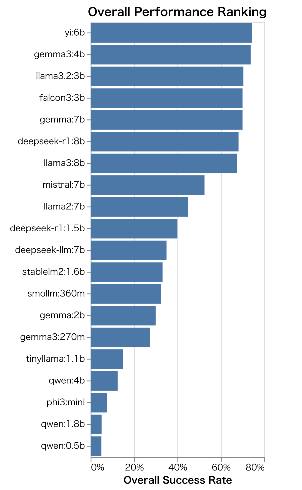

# Benchmarking Large Language Models Against Prompt Formats: Experimental Methods and Results

## 1. Introduction

While Large Language Models (LLMs) show remarkable capabilities across a wide range of applications (Zhao, W. X., et al., 2023), two persistent challenges complicate the evaluation of their true abilities. The first is **Prompt Sensitivity**, where performance varies dramatically with minor changes to the input prompt. The second, **Data Contamination**, occurs when benchmark data is included in a model's training set (Vaugrante, et al., 2025). This contamination raises a critical question: are models genuinely reasoning, or are they merely demonstrating rote memorization? This issue, prevalent in many popular leaderboards, obscures understanding of a model's generalization capabilities on truly novel problems.

This study introduces a new benchmark designed to assess LLM capabilities in a contamination-free environment. Our methodology incorporates two novel elements: (1) the use of **Lojban**, a constructed logical language with an unambiguous grammar virtually absent from pre-training corpora, and (2) **Symbolic Prompting**, our custom-designed suite of tasks using formats like S-expressions and JSON. This approach forces models to interpret and execute unfamiliar formal systems on the fly. It thereby allows us to measure genuine adaptation and algorithmic implementation skills rather than simple memory retrieval.

This paper presents our reproducible experimental framework, the resulting dataset, and a detailed analysis of the findings. The results lead to three primary contributions:
1.  They suggest that prompt strictness, particularly in specifying the output format, is crucial for eliciting latent model abilities, which lends support to the 'mirage' theory of emergent abilities (Schaeffer, et al., 2023).
2.  They indicate a clear ceiling in current models' abilities to handle algorithmic complexity. While models can mimic the structure of an algorithm like backtracking, they systematically fail to produce bug-free implementations.
3.  They provide strong evidence that LLMs process unfamiliar, syntactically unambiguous languages as a series of unknown tokens, suggesting their understanding is based on statistical pattern matching rather than abstract reasoning.

The following sections detail the experimental environment, task designs, empirical results, and a discussion of their implications. Through this work, we provide a more accurate lens for evaluating LLMs and contribute to the development of more robust AI systems.

## 2. Experimental Environment

### 2.1. Setting up the Execution Environment

To reproduce this experimental package, it is recommended to set up a Python virtual environment following the procedure described in the project's `README.md` file.

### 2.2. Evaluated Models and Inference Parameters

This study evaluates a range of open-source language models with fewer than 8 billion parameters, accessed via Ollama. The specific models and their inference hyperparameters are summarized in Table 1.

**Table 1: Evaluated Models and Inference Hyperparameters**

| Model Name (Ollama) | Parameters | Quantization (Est.) | Temperature | Top P | Seed |
|:---|:---:|:---:|:---:|:---:|:---:|
| `gemma3:270m` | 0.27B | Q4_K_M | 0.0 | 1.0 | 0 |
| `smollm:360m` | 0.36B | Q4_K_M | 0.0 | 1.0 | 0 |
| `qwen:0.5b` | 0.5B | Q4_K_M | 0.0 | 1.0 | 0 |
| `tinyllama:1.1b` | 1.1B | Q4_K_M | 0.0 | 1.0 | 0 |
| `deepseek-r1:1.5b`| 1.5B | Unknown | 0.0 | 1.0 | 0 |
| `stablelm2:1.6b` | 1.6B | Q4_K_M | 0.0 | 1.0 | 0 |
| `qwen:1.8b` | 1.8B | Q4_K_M | 0.0 | 1.0 | 0 |
| `gemma:2b` | 2B | Q4_K_M | 0.0 | 1.0 | 0 |
| `falcon3:3b` | 3B | Unknown | 0.0 | 1.0 | 0 |
| `llama3.2:3b` | 3.2B | Unknown | 0.0 | 1.0 | 0 |
| `phi3:mini` | 3.8B | Q4_K_M | 0.0 | 1.0 | 0 |
| `gemma3:4b` | 4B | Q4_K_M | 0.0 | 1.0 | 0 |
| `qwen:4b` | 4B | Q4_K_M | 0.0 | 1.0 | 0 |
| `yi:6b` | 6B | Q4_K_M | 0.0 | 1.0 | 0 |
| `gemma:7b` | 7B | Q4_K_M | 0.0 | 1.0 | 0 |
| `mistral:7b` | 7B | Q4_K_M | 0.0 | 1.0 | 0 |
| `llama2:7b` | 7B | Q4_K_M | 0.0 | 1.0 | 0 |
| `deepseek-llm:7b` | 7B | Q4_K_M | 0.0 | 1.0 | 0 |
| `deepseek-r1:8b` | 8B | Unknown | 0.0 | 1.0 | 0 |
| `llama3:8b` | 8B | Q4_K_M | 0.0 | 1.0 | 0 |

*Note: Quantization methods are based on the Ollama library's defaults, typically `Q4_K_M` where specified. Details for some models marked 'Unknown' were not available.*

To ensure deterministic reproducibility, all experiments were conducted with inference hyperparameters fixed at `temperature: 0.0`, `top_p: 1.0`, and `seed: 0`. This setup minimizes stochastic variations in model responses, allowing for a focused evaluation of the impact of the prompt format itself.

### 2.3. Evaluation Criteria

This benchmark defines task-specific success criteria as follows:

**Code Generation Tasks**: Success is defined as the generated Python code passing all predefined `Pytest` unit tests **without any modification**. Each task is attempted only once, making this a strict **Pass@1** evaluation.

**String Generation Task** (`filtered_list`): Success requires that the list-formatted string returned by the model perfectly matches the expected output at the character level. This test evaluates the ability to follow instructions and adhere to a format directly, rather than generating code.

**Logical Reasoning Tasks**:
*   **Implementation Correctness**: Success is defined as the generated code correctly implementing the given logic (from S-expressions, JSON, a custom token language, etc.) and passing all associated unit tests.
*   **Qualitative Analysis of Thought Process**: For tasks requiring Chain-of-Thought, the generated reasoning is qualitatively analyzed for faithfulness to the rules, logical consistency, and its influence on the final answer.

## 3. Overview of Experimental Design

The benchmark comprises a suite of tasks that span from simple code generation to complex logical reasoning. For a complete description of each test, refer to the `README.md` file. This section highlights the conceptual design of four key experiments.

### 3.1. Conceptual Diagrams of Each Test

The following diagrams illustrate the workflows of the main tests in this benchmark.

**Figure 1: Conceptual workflow for simple code generation tasks.** The LLM receives a natural language prompt and must produce Python code that passes automated `Pytest` verification.

{width=65%}

**Figure 2: Workflow for the `filtered_list` task.** This evaluates the ability to adhere to strict output formatting by requiring a specific string output, not executable code.

{width=65%}

**Figure 3: Workflow for symbolic reasoning tasks.** The LLM must interpret rules defined in a formal language (e.g., S-expression, JSON) and generate a Python function that implements them.

{width=65%}

**Figure 4: Workflow for the `einstein_token_test` task.** This multi-stage challenge requires the LLM to learn an unknown grammar and a backtracking algorithm from a single prompt to implement a bug-free solver.

{width=65%}

## 4. Results

Across all experiments, several key trends emerged that highlight the inconsistent and format-dependent nature of LLM performance. While detailed success rates for all 30 runs of each test are available in Appendix A, this section summarizes the four principal findings.

1.  **Language Sensitivity**: Models achieved high success rates on tasks prompted in familiar natural languages like English and Japanese. However, performance dropped precipitously on the same tasks when prompted in Lojban, an unambiguous but unfamiliar logical language.

2.  **Effectiveness of Symbolic Prompts**: For certain logical reasoning tasks (e.g., `diagnosis`), prompts formatted in unambiguous symbolic languages like S-expressions and JSON led to higher success rates for some models compared to natural language prompts.

3.  **Algorithmic Implementation Failure**: In the `einstein_token_test`, the most complex task requiring on-the-fly grammar and algorithm learning, **no model succeeded**. This universal failure points to a significant limitation in the ability of LLMs to implement novel, bug-free algorithms from scratch.

4.  **Model Size vs. Performance**: The overall performance rankings (see Section 5.4) reveal that model size does not reliably predict success on the complex logical and algorithmic reasoning tasks presented in this benchmark. Several smaller models outperformed larger ones.

The following section provides a detailed analysis and discussion of the implications of each of these findings.

## 5. Discussion

This section analyzes the four principal findings presented in the Results section, arguing that the capabilities of LLMs are often the product of successfully elicited pattern-matching rather than abstract reasoning.

### 5.1. The Role and Limits of Prompt Strictness

The results indicate that prompt strictness plays a crucial role in eliciting correct model behavior, but that its effectiveness is contingent on linguistic familiarity. This effect was most evident in the `Filtered List` test. An initial, ambiguous instruction to "return a list" prompted most models to generate Python code, a behavior likely reflecting training data bias. When a strict constraint was added—"Return only the list string, not a program code"—performance improved dramatically for prompts in English and Japanese. This finding suggests that a model's latent capabilities can be unlocked, or 'elicited,' by removing ambiguity from the expected output format.

The elicitation effect, however, disappeared when the language itself was unfamiliar. In Lojban, all models failed the `Filtered List` test, even with the strict prompt. This contrast indicates that the models did not leverage Lojban's unambiguous grammar for logical deduction. Instead, they appear to process it as an unknown sequence of tokens, failing to perform the semantic task of mapping Lojban's logic to a specific output format. Such an asymmetric capability is consistent with the "Reversal Curse," where models trained on "A is B" fail to infer "B is A" (Berglund, et al., 2023). Our findings suggest this is a broader problem of asymmetry between language understanding and logical execution.

### 5.2. A Ceiling in Algorithmic Implementation

The universal failure on the `Einstein Riddle - token_test` suggests a ceiling in the ability of current LLMs to implement novel, complex algorithms. The design of this test allowed for a phased analysis of this limitation:
1.  **Grammar Learning**: Models began to generate syntactically aware code once provided with grammar rules for the unknown token language.
2.  **Structural Mimicry**: The inclusion of a few-shot example of a backtracking algorithm enabled models like `llama3:8b` to successfully mimic its recursive structure.
3.  **Implementation Failure**: At the final stage, all models failed. The resulting code, while structurally plausible, contained subtle but fatal implementation bugs.

A qualitative analysis of code generated by `llama3:8b` highlights a common error: a failure to ensure state independence during recursion. The model passed the solution state (`assignments`) directly to recursive calls without copying it. This caused search branches to interfere with each other and led to `KeyError` exceptions or timeouts.

```python
# Schematic excerpt of code generated by llama3:8b
def solve_puzzle(rules, assignments):
    # ...
    for value in domain_values(var):
        # Fatal Flaw: The dictionary is mutated directly,
        # leaking state across independent search paths.
        assignments[var] = value 
        if is_consistent(assignments, rules):
            # The next recursive call receives the mutated state.
            result = solve_puzzle(rules, assignments)
            if result is not None:
                return result
    # The backtracking step to undo the mutation is missing.
    return None
```

This type of error indicates that while an LLM can imitate the **superficial structure** of an algorithm (e.g., loops and recursion), it may not grasp the underlying **logical requirements** for that algorithm to function, such as state isolation in backtracking. This finding aligns with reported systematic failures in compositional reasoning and suggests that model abilities in this area may be confined to sophisticated pattern matching rather than abstract algorithmic understanding.

### 5.3. Effectiveness of Symbolic Prompts as a Reasoning Interface

For the `diagnosis` and `einstein` tasks, prompts using unambiguous symbolic languages like S-expressions and JSON resulted in higher success rates for some models compared to natural language equivalents. This outcome suggests that for problems with a clear logical structure, symbolic formats can serve as an effective computational interface for LLMs. This success may be attributable to two factors:

*   **Syntactic Unambiguity**: Formal grammars eliminate the interpretive ambiguity of natural language. An S-expression like `(or (and A B) C)` has a single, precise syntax tree, which may reduce a model's cognitive overhead and allow it to grasp the relationships between rules more structurally.
*   **Token Efficiency**: Symbolic languages can often express complex logical relationships more concisely than natural language, which allows more information to be processed within a finite context window.

This finding lends support to the value of hybrid approaches that combine the strengths of LLMs with the rigor of symbolic reasoning to overcome some of the inherent limitations of deep learning models (Marcus, 2020).

### 5.4. Performance Analysis: Model Size, Ranking, and Lojban

The results also call into question the assumption that larger models are universally more capable. The overall performance ranking (Figure 5) shows that `yi:6b` and `gemma3:4b` outperformed several larger models on this suite of tests. This may indicate that architectural differences and training data composition play a more significant role than parameter count alone in the specific logical reasoning capabilities measured here.

{width=65%}

The consistent, poor performance on Lojban tasks provides further evidence that current LLMs may rely on pattern recognition over abstract reasoning. To investigate this, a separate suite of basic Lojban tasks was run, including simple translation. The outcome was notable: all 20 evaluated models failed every one of these foundational tasks. This result strongly suggests that the few successes seen in the main benchmark were not due to an understanding of Lojban's logic, but rather a superficial "transpilation" of token patterns.

This difficulty with Lojban may originate at the tokenizer level. A standard Byte-Pair Encoding (BPE) tokenizer, trained on mainstream languages, would likely fragment Lojban's unique morphology (e.g., `fancu`, `namcu`) into meaningless sub-tokens. Such inefficient tokenization could fundamentally impede a model's ability to learn word-level semantics, thereby preventing a higher-order understanding of syntax or logic.

## 6. Conclusion

This paper introduced a novel, contamination-free benchmark to evaluate how LLM responses are affected by prompt format. By using the constructed language Lojban and a series of custom symbolic reasoning tasks, this study tested the limits of model reasoning and implementation abilities.

Our findings lead to three primary conclusions. First, while prompt strictness can be an effective tool for eliciting latent capabilities, its utility appears limited to familiar linguistic contexts. Second, current LLMs seem to exhibit a ceiling in complex algorithmic implementation; they can mimic superficial structures but may not grasp the underlying logic required for bug-free code. Third, the models' difficulty with Lojban, contrasted with their success on some symbolic prompts, suggests that their capabilities may be rooted more in sophisticated pattern matching than in abstract reasoning. These observations lend further support to the 'mirage' theory of emergent abilities (Schaeffer, et al., 2023).

This study's limitations open direct avenues for future research. The focus on lightweight, open-source models invites a comparative analysis with larger models (e.g., GPT-4, Claude 3). The algorithmic tests could also be expanded beyond backtracking to other complex tasks like dynamic programming to probe the generality of our findings. Finally, the use of deterministic generation parameters (`temperature: 0.0`) leaves room to explore how stochastic settings affect performance.

We hope that the experimental framework and dataset provided in this paper will contribute to future research on the true capabilities of LLMs and aid in the construction of more reliable AI systems.

## 7. Ethical Considerations

This study highlights significant performance disparities in LLMs when prompted with non-mainstream languages like Lojban and Esperanto. These results suggest that current models are predominantly trained on data from mainstream languages such as English, creating a bias that risks the inadequate representation of other languages and cultures. From an ethical standpoint, our work underscores the need for greater diversity and inclusivity in the datasets used for future model development.

## 8. References

Anam, M. (2025). *Prompt Engineering and the Effectiveness of Large Language Models in Enhancing Human Productivity*. arXiv preprint arXiv:2507.18638.

Berglund, L., et al. (2023). *The Reversal Curse: LLMs trained on "A is B" fail to learn "B is A"*. arXiv preprint arXiv:2309.12288.

Besta, M., et al. (2023). *Graph of Thoughts: Solving Elaborate Problems with Large Language Models*. arXiv preprint arXiv:2308.09687.

Gao, L., et al. (2022). *Program-Aided Language Models*. arXiv preprint arXiv:2211.10435.

Marcus, G. (2020). *The Next Decade in AI: Four Steps Towards Robust Artificial Intelligence*. arXiv preprint arXiv:2002.06177.

Ronanki, S., et al. (2025). *Prompt Engineering Guidelines for Using Large Language Models in Requirements Engineering*. arXiv preprint arXiv:2507.03405.

Schaeffer, R., et al. (2023). *Are Emergent Abilities of Large Language Models a Mirage?*. arXiv preprint arXiv:2304.15004.

Thomas, A. W., et al. (2023). *Unsolvable Problems for Large Language Models: A Formal Language Approach*. arXiv preprint arXiv:2310.16799.

Vaugrante, L., et al. (2025). *Prompt Engineering Techniques for Language Model Reasoning Lack Replicability*. In *Transactions on Machine Learning Research*.

Wei, J., et al. (2022). *Chain-of-Thought Prompting Elicits Reasoning in Large Language Models*. In *Advances in Neural Information Processing Systems 35*.

Wei, J., et al. (2022). *Emergent Abilities of Large Language Models*. arXiv preprint arXiv:2206.07682.

Yao, S., et al. (2023). *Tree of Thoughts: Deliberate Problem Solving with Large Language Models*. arXiv preprint arXiv:2305.10601.

Zhao, W. X., et al. (2023). *A Survey of Large Language Models*. arXiv preprint arXiv:2303.18223.

# Appendix A: Detailed Experiment Results

Below is a summary of the number of successful trials from a large-scale experiment with 30 runs for each test.

# Experiment Results Summary

### Return One Success Rates
| Model / Language | ja | en | eo | jbo |
| :--- |  :---: | :---: | :---: | :---: |
| `gemma3:270m` | 0/30 | 0/30 | 0/30 | 0/30 |
| `smollm:360m` | 0/30 | 30/30 | 30/30 | 0/30 |
| `qwen:0.5b` | 0/30 | 30/30 | 0/30 | 0/30 |
| `tinyllama:1.1b` | 30/30 | 30/30 | 30/30 | 0/30 |
| `deepseek-r1:1.5b` | 30/30 | 30/30 | 30/30 | 0/30 |
| `stablelm2:1.6b` | 30/30 | 30/30 | 30/30 | 1/30 |
| `qwen:1.8b` | 30/30 | 30/30 | 0/30 | 1/30 |
| `gemma:2b` | 30/30 | 30/30 | 30/30 | 0/30 |
| `falcon3:3b` | 30/30 | 30/30 | 30/30 | 0/30 |
| `llama3.2:3b` | 30/30 | 30/30 | 30/30 | 30/30 |
| `phi3:mini` | 30/30 | 30/30 | 30/30 | 0/30 |
| `gemma3:4b` | 30/30 | 30/30 | 30/30 | 30/30 |
| `qwen:4b` | 30/30 | 30/30 | 30/30 | 0/30 |
| `yi:6b` | 30/30 | 30/30 | 30/30 | 30/30 |
| `gemma:7b` | 30/30 | 30/30 | 30/30 | 30/30 |
| `mistral:7b` | 30/30 | 30/30 | 30/30 | 30/30 |
| `llama2:7b` | 30/30 | 30/30 | 30/30 | 0/30 |
| `deepseek-llm:7b` | 30/30 | 30/30 | 30/30 | 0/30 |
| `deepseek-r1:8b` | 30/30 | 30/30 | 30/30 | 30/30 |
| `llama3:8b` | 29/30 | 30/30 | 30/30 | 30/30 |

### Copy List Success Rates
| Model / Language | ja | en | eo | jbo |
| :--- |  :---: | :---: | :---: | :---: |
| `gemma3:270m` | 30/30 | 30/30 | 0/30 | 0/30 |
| `smollm:360m` | 30/30 | 30/30 | 30/30 | 30/30 |
| `qwen:0.5b` | 0/30 | 0/30 | 0/30 | 0/30 |
| `tinyllama:1.1b` | 30/30 | 30/30 | 30/30 | 0/30 |
| `deepseek-r1:1.5b` | 30/30 | 30/30 | 0/30 | 0/30 |
| `stablelm2:1.6b` | 0/30 | 30/30 | 30/30 | 0/30 |
| `qwen:1.8b` | 0/30 | 0/30 | 0/30 | 0/30 |
| `gemma:2b` | 30/30 | 30/30 | 30/30 | 0/30 |
| `falcon3:3b` | 30/30 | 30/30 | 30/30 | 30/30 |
| `llama3.2:3b` | 30/30 | 30/30 | 30/30 | 30/30 |
| `phi3:mini` | 0/30 | 0/30 | 0/30 | 0/30 |
| `gemma3:4b` | 30/30 | 30/30 | 30/30 | 15/30 |
| `qwen:4b` | 0/30 | 30/30 | 0/30 | 0/30 |
| `yi:6b` | 30/30 | 30/30 | 30/30 | 30/30 |
| `gemma:7b` | 30/30 | 30/30 | 0/30 | 30/30 |
| `mistral:7b` | 30/30 | 30/30 | 30/30 | 30/30 |
| `llama2:7b` | 0/30 | 30/30 | 30/30 | 0/30 |
| `deepseek-llm:7b` | 30/30 | 30/30 | 30/30 | 0/30 |
| `deepseek-r1:8b` | 30/30 | 30/30 | 30/30 | 30/30 |
| `llama3:8b` | 0/30 | 30/30 | 0/30 | 0/30 |

### Simple Sort Success Rates
| Model / Language | ja | en | eo | jbo |
| :--- |  :---: | :---: | :---: | :---: |
| `gemma3:270m` | 30/30 | 30/30 | 0/30 | 0/30 |
| `smollm:360m` | 0/30 | 30/30 | 0/30 | 0/30 |
| `qwen:0.5b` | 30/30 | 0/30 | 0/30 | 0/30 |
| `tinyllama:1.1b` | 0/30 | 0/30 | 0/30 | 0/30 |
| `deepseek-r1:1.5b` | 30/30 | 30/30 | 0/30 | 30/30 |
| `stablelm2:1.6b` | 0/30 | 30/30 | 30/30 | 0/30 |
| `qwen:1.8b` | 0/30 | 0/30 | 0/30 | 0/30 |
| `gemma:2b` | 30/30 | 0/30 | 0/30 | 0/30 |
| `falcon3:3b` | 30/30 | 30/30 | 30/30 | 30/30 |
| `llama3.2:3b` | 30/30 | 30/30 | 30/30 | 30/30 |
| `phi3:mini` | 0/30 | 0/30 | 0/30 | 0/30 |
| `gemma3:4b` | 30/30 | 30/30 | 30/30 | 30/30 |
| `qwen:4b` | 0/30 | 30/30 | 0/30 | 0/30 |
| `yi:6b` | 30/30 | 30/30 | 30/30 | 30/30 |
| `gemma:7b` | 30/30 | 30/30 | 30/30 | 30/30 |
| `mistral:7b` | 30/30 | 30/30 | 30/30 | 30/30 |
| `llama2:7b` | 30/30 | 30/30 | 30/30 | 0/30 |
| `deepseek-llm:7b` | 0/30 | 30/30 | 30/30 | 0/30 |
| `deepseek-r1:8b` | 30/30 | 30/30 | 30/30 | 30/30 |
| `llama3:8b` | 30/30 | 30/30 | 30/30 | 30/30 |

### Reverse Sort Success Rates
| Model / Language | ja | en | eo | jbo |
| :--- |  :---: | :---: | :---: | :---: |
| `gemma3:270m` | 0/30 | 0/30 | 0/30 | 0/30 |
| `smollm:360m` | 0/30 | 30/30 | 30/30 | 0/30 |
| `qwen:0.5b` | 0/30 | 0/30 | 0/30 | 0/30 |
| `tinyllama:1.1b` | 0/30 | 0/30 | 0/30 | 0/30 |
| `deepseek-r1:1.5b` | 30/30 | 30/30 | 30/30 | 0/30 |
| `stablelm2:1.6b` | 22/30 | 30/30 | 0/30 | 30/30 |
| `qwen:1.8b` | 0/30 | 0/30 | 0/30 | 0/30 |
| `gemma:2b` | 0/30 | 0/30 | 0/30 | 0/30 |
| `falcon3:3b` | 30/30 | 30/30 | 30/30 | 30/30 |
| `llama3.2:3b` | 30/30 | 30/30 | 30/30 | 30/30 |
| `phi3:mini` | 0/30 | 0/30 | 0/30 | 0/30 |
| `gemma3:4b` | 30/30 | 30/30 | 30/30 | 30/30 |
| `qwen:4b` | 0/30 | 0/30 | 0/30 | 0/30 |
| `yi:6b` | 30/30 | 30/30 | 30/30 | 30/30 |
| `gemma:7b` | 30/30 | 30/30 | 30/30 | 30/30 |
| `mistral:7b` | 30/30 | 30/30 | 30/30 | 30/30 |
| `llama2:7b` | 30/30 | 30/30 | 30/30 | 0/30 |
| `deepseek-llm:7b` | 0/30 | 30/30 | 30/30 | 0/30 |
| `deepseek-r1:8b` | 30/30 | 30/30 | 30/30 | 30/30 |
| `llama3:8b` | 30/30 | 30/30 | 30/30 | 30/30 |

### Length Sort Success Rates
| Model / Language | ja | en | eo | jbo |
| :--- |  :---: | :---: | :---: | :---: |
| `gemma3:270m` | 30/30 | 30/30 | 0/30 | 0/30 |
| `smollm:360m` | 30/30 | 30/30 | 30/30 | 30/30 |
| `qwen:0.5b` | 0/30 | 0/30 | 0/30 | 0/30 |
| `tinyllama:1.1b` | 0/30 | 0/30 | 0/30 | 0/30 |
| `deepseek-r1:1.5b` | 30/30 | 30/30 | 0/30 | 0/30 |
| `stablelm2:1.6b` | 0/30 | 30/30 | 29/30 | 0/30 |
| `qwen:1.8b` | 0/30 | 0/30 | 0/30 | 0/30 |
| `gemma:2b` | 0/30 | 0/30 | 0/30 | 0/30 |
| `falcon3:3b` | 0/30 | 30/30 | 30/30 | 30/30 |
| `llama3.2:3b` | 30/30 | 30/30 | 30/30 | 30/30 |
| `phi3:mini` | 0/30 | 0/30 | 0/30 | 0/30 |
| `gemma3:4b` | 30/30 | 30/30 | 30/30 | 30/30 |
| `qwen:4b` | 0/30 | 0/30 | 0/30 | 0/30 |
| `yi:6b` | 30/30 | 30/30 | 30/30 | 0/30 |
| `gemma:7b` | 30/30 | 30/30 | 30/30 | 0/30 |
| `mistral:7b` | 30/30 | 29/30 | 30/30 | 0/30 |
| `llama2:7b` | 0/30 | 30/30 | 30/30 | 30/30 |
| `deepseek-llm:7b` | 0/30 | 30/30 | 30/30 | 0/30 |
| `deepseek-r1:8b` | 30/30 | 30/30 | 30/30 | 30/30 |
| `llama3:8b` | 30/30 | 30/30 | 30/30 | 30/30 |

### Custom Sort Success Rates
| Model / Language | ja | en | eo | jbo |
| :--- |  :---: | :---: | :---: | :---: |
| `gemma3:270m` | 0/30 | 0/30 | 0/30 | 0/30 |
| `smollm:360m` | 0/30 | 0/30 | 0/30 | 0/30 |
| `qwen:0.5b` | 0/30 | 0/30 | 0/30 | 0/30 |
| `tinyllama:1.1b` | 0/30 | 0/30 | 0/30 | 0/30 |
| `deepseek-r1:1.5b` | 30/30 | 0/30 | 30/30 | 0/30 |
| `stablelm2:1.6b` | 0/30 | 0/30 | 0/30 | 0/30 |
| `qwen:1.8b` | 0/30 | 0/30 | 0/30 | 0/30 |
| `gemma:2b` | 0/30 | 0/30 | 0/30 | 0/30 |
| `falcon3:3b` | 30/30 | 30/30 | 30/30 | 0/30 |
| `llama3.2:3b` | 30/30 | 30/30 | 30/30 | 0/30 |
| `phi3:mini` | 0/30 | 0/30 | 0/30 | 0/30 |
| `gemma3:4b` | 30/30 | 30/30 | 30/30 | 0/30 |
| `qwen:4b` | 0/30 | 0/30 | 0/30 | 0/30 |
| `yi:6b` | 30/30 | 30/30 | 30/30 | 30/30 |
| `gemma:7b` | 30/30 | 30/30 | 30/30 | 0/30 |
| `mistral:7b` | 0/30 | 0/30 | 0/30 | 0/30 |
| `llama2:7b` | 0/30 | 0/30 | 0/30 | 0/30 |
| `deepseek-llm:7b` | 0/30 | 0/30 | 30/30 | 0/30 |
| `deepseek-r1:8b` | 29/30 | 30/30 | 30/30 | 0/30 |
| `llama3:8b` | 0/30 | 30/30 | 0/30 | 0/30 |

### Roundtrip (Fibonacci S-Expr) Success Rates
| Model / Format | sexpr |
| :--- |  :---: |
| `gemma3:270m` | 0/30 |
| `smollm:360m` | 0/30 |
| `qwen:0.5b` | 0/30 |
| `tinyllama:1.1b` | 0/30 |
| `deepseek-r1:1.5b` | 0/30 |
| `stablelm2:1.6b` | 0/30 |
| `qwen:1.8b` | 0/30 |
| `gemma:2b` | 0/30 |
| `falcon3:3b` | 0/30 |
| `llama3.2:3b` | 0/30 |
| `phi3:mini` | 0/30 |
| `gemma3:4b` | 30/30 |
| `qwen:4b` | 0/30 |
| `yi:6b` | 23/30 |
| `gemma:7b` | 0/30 |
| `mistral:7b` | 30/30 |
| `llama2:7b` | 0/30 |
| `deepseek-llm:7b` | 0/30 |
| `deepseek-r1:8b` | 8/30 |
| `llama3:8b` | 0/30 |

### Diagnosis Logic Success Rates
| Model / Format | s_expr | json | tsv | token_test |
| :--- |  :---: | :---: | :---: | :---: |
| `gemma3:270m` | 0/30 | 0/30 | 0/30 | 0/30 |
| `smollm:360m` | 0/30 | 0/30 | 0/30 | 0/30 |
| `qwen:0.5b` | 0/30 | 0/30 | 0/30 | 0/30 |
| `tinyllama:1.1b` | 0/30 | 0/30 | 0/30 | 0/30 |
| `deepseek-r1:1.5b` | 30/30 | 0/30 | 0/30 | 0/30 |
| `stablelm2:1.6b` | 28/30 | 0/30 | 0/30 | 4/30 |
| `qwen:1.8b` | 0/30 | 0/30 | 0/30 | 0/30 |
| `gemma:2b` | 30/30 | 0/30 | 30/30 | 30/30 |
| `falcon3:3b` | 30/30 | 30/30 | 30/30 | 0/30 |
| `llama3.2:3b` | 30/30 | 30/30 | 5/30 | 30/30 |
| `phi3:mini` | 0/30 | 0/30 | 0/30 | 0/30 |
| `gemma3:4b` | 30/30 | 30/30 | 30/30 | 30/30 |
| `qwen:4b` | 0/30 | 0/30 | 0/30 | 0/30 |
| `yi:6b` | 30/30 | 0/30 | 30/30 | 30/30 |
| `gemma:7b` | 30/30 | 30/30 | 30/30 | 30/30 |
| `mistral:7b` | 0/30 | 0/30 | 0/30 | 30/30 |
| `llama2:7b` | 0/30 | 0/30 | 0/30 | 30/30 |
| `deepseek-llm:7b` | 0/30 | 0/30 | 0/30 | 30/30 |
| `deepseek-r1:8b` | 29/30 | 1/30 | 1/30 | 0/30 |
| `llama3:8b` | 30/30 | 30/30 | 30/30 | 30/30 |

### Einstein Riddle Success Rates (Symbolic Formats)
| Model | s_expr | json | token_test |
| :--- |  :---: | :---: | :---: |
| `gemma3:270m` | 30/30 | 30/30 | 0/30 |
| `smollm:360m` | 0/30 | 0/30 | 0/30 |
| `qwen:0.5b` | 0/30 | 0/30 | 0/30 |
| `tinyllama:1.1b` | 0/30 | 0/30 | 0/30 |
| `deepseek-r1:1.5b` | 0/30 | 0/30 | 0/30 |
| `stablelm2:1.6b` | 0/30 | 0/30 | 0/30 |
| `qwen:1.8b` | 0/30 | 0/30 | 0/30 |
| `gemma:2b` | 30/30 | 0/30 | 0/30 |
| `falcon3:3b` | 0/30 | 30/30 | 30/30 |
| `llama3.2:3b` | 0/30 | 0/30 | 0/30 |
| `phi3:mini` | 0/30 | 0/30 | 0/30 |
| `gemma3:4b` | 0/30 | 0/30 | 0/30 |
| `qwen:4b` | 0/30 | 0/30 | 0/30 |
| `yi:6b` | 30/30 | 30/30 | 0/30 |
| `gemma:7b` | 0/30 | 30/30 | 0/30 |
| `mistral:7b` | 0/30 | 0/30 | 0/30 |
| `llama2:7b` | 0/30 | 0/30 | 0/30 |
| `deepseek-llm:7b` | 0/30 | 0/30 | 0/30 |
| `deepseek-r1:8b` | 0/30 | 0/30 | 0/30 |
| `llama3:8b` | 30/30 | 30/30 | 0/30 |

### Einstein Riddle Success Rates (CoT Formats)
| Model | cot_ja | cot_en | cot_eo | cot_jbo |
| :--- |  :---: | :---: | :---: | :---: |
| `gemma3:270m` | 30/30 | 30/30 | 0/30 | 30/30 |
| `smollm:360m` | 0/30 | 0/30 | 0/30 | 0/30 |
| `qwen:0.5b` | 0/30 | 0/30 | 0/30 | 0/30 |
| `tinyllama:1.1b` | 0/30 | 0/30 | 0/30 | 0/30 |
| `deepseek-r1:1.5b` | 0/30 | 0/30 | 0/30 | 0/30 |
| `stablelm2:1.6b` | 0/30 | 7/30 | 4/30 | 3/30 |
| `qwen:1.8b` | 0/30 | 0/30 | 0/30 | 0/30 |
| `gemma:2b` | 0/30 | 0/30 | 30/30 | 0/30 |
| `falcon3:3b` | 30/30 | 0/30 | 30/30 | 0/30 |
| `llama3.2:3b` | 0/30 | 0/30 | 0/30 | 30/30 |
| `phi3:mini` | 0/30 | 0/30 | 0/30 | 0/30 |
| `gemma3:4b` | 0/30 | 30/30 | 0/30 | 0/30 |
| `qwen:4b` | 0/30 | 0/30 | 0/30 | 0/30 |
| `yi:6b` | 0/30 | 0/30 | 0/30 | 30/30 |
| `gemma:7b` | 0/30 | 30/30 | 0/30 | 0/30 |
| `mistral:7b` | 0/30 | 0/30 | 0/30 | 1/30 |
| `llama2:7b` | 30/30 | 0/30 | 30/30 | 0/30 |
| `deepseek-llm:7b` | 0/30 | 0/30 | 0/30 | 0/30 |
| `deepseek-r1:8b` | 0/30 | 0/30 | 0/30 | 0/30 |
| `llama3:8b` | 0/30 | 0/30 | 30/30 | 0/30 |

### Filtered List Success Rates
| Model / Language | ja | en | eo | jbo |
| :--- |  :---: | :---: | :---: | :---: |
| `gemma3:270m` | 0/30 | 0/30 | 0/30 | 0/30 |
| `smollm:360m` | 0/30 | 0/30 | 0/30 | 0/30 |
| `qwen:0.5b` | 0/30 | 0/30 | 0/30 | 0/30 |
| `tinyllama:1.1b` | 0/30 | 0/30 | 0/30 | 0/30 |
| `deepseek-r1:1.5b` | 0/30 | 0/30 | 0/30 | 0/30 |
| `stablelm2:1.6b` | 0/30 | 0/30 | 0/30 | 0/30 |
| `qwen:1.8b` | 0/30 | 0/30 | 0/30 | 0/30 |
| `gemma:2b` | 0/30 | 0/30 | 0/30 | 0/30 |
| `falcon3:3b` | 0/30 | 0/30 | 0/30 | 0/30 |
| `llama3.2:3b` | 0/30 | 30/30 | 0/30 | 0/30 |
| `phi3:mini` | 0/30 | 0/30 | 0/30 | 0/30 |
| `gemma3:4b` | 0/30 | 30/30 | 0/30 | 0/30 |
| `qwen:4b` | 0/30 | 0/30 | 0/30 | 0/30 |
| `yi:6b` | 0/30 | 0/30 | 0/30 | 0/30 |
| `gemma:7b` | 0/30 | 30/30 | 0/30 | 0/30 |
| `mistral:7b` | 0/30 | 0/30 | 0/30 | 0/30 |
| `llama2:7b` | 0/30 | 30/30 | 0/30 | 0/30 |
| `deepseek-llm:7b` | 0/30 | 0/30 | 0/30 | 0/30 |
| `deepseek-r1:8b` | 30/30 | 30/30 | 30/30 | 0/30 |
| `llama3:8b` | 30/30 | 30/30 | 0/30 | 0/30 |