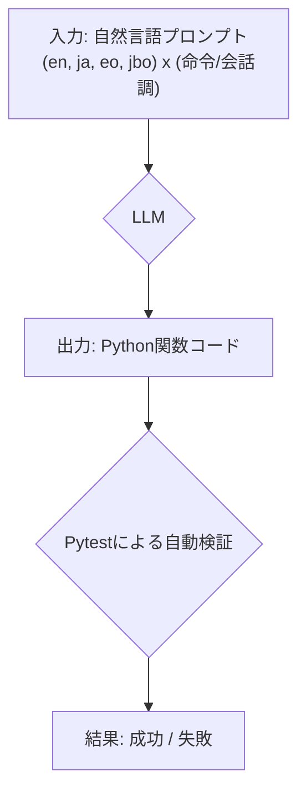
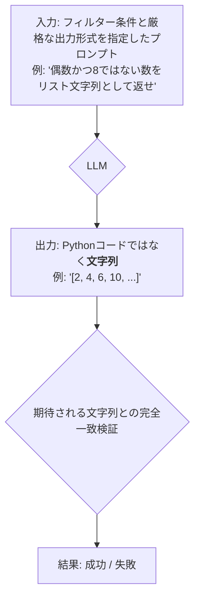
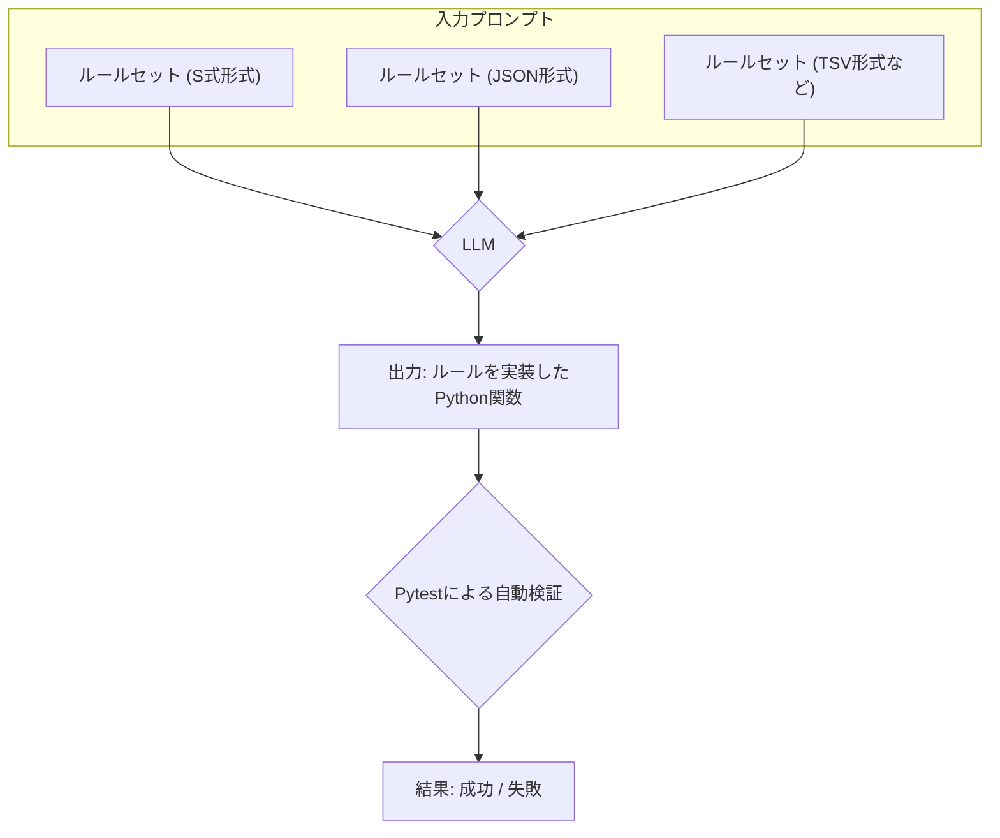
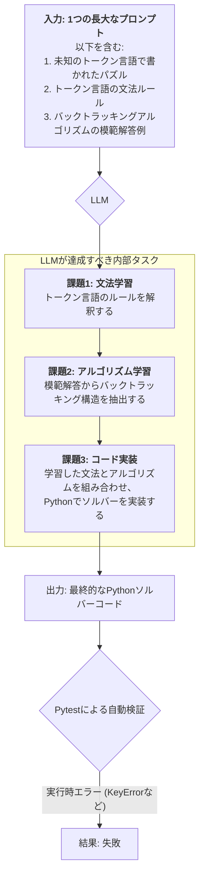

# 大規模言語モデルのプロンプト形式に対するベンチマーク：実験手法と結果

## 1. 緒言

大規模言語モデル（LLM）は、その驚異的な能力から様々な分野で活用されているが（Zhao, W. X., et al., 2023）、その性能はプロンプトの設計に大きく依存する**プロンプト感度（Prompt Sensitivity）**の問題を内包している。さらに、Hugging FaceのOpen LLM Leaderboardのような既存のベンチマークは、学習データに評価データが含まれてしまう**「データ汚染（Data Contamination）」**の問題を抱えており、モデルが真の推論能力ではなく、単に「回答を記憶」しているだけではないかという懸念が指摘されている。これらの課題は、LLMの真の能力、特に未知の問題に対する汎化性能を測定することの困難さを示している。

この「なぜ今、このベンチマークが必要なのか」という問いに答えるため、本研究では、データ汚染の可能性を原理的に排除した新しい評価軸を提案する。具体的には、学習データに含まれる可能性が極めて低い人工言語ロジバンや、本研究で独自に設計した**記号的プロンプティング（Symbolic Prompting）**を用いる。これにより、既存の**記号的推論ベンチマーク**とは異なり、モデルの記憶能力への依存を排し、未知の形式言語に対する真の推論・適応能力を測定することを目指す。

プロンプトエンジニアリング技術の再現性の欠如は深刻な課題であり(Vaugrante, et al., 2025)、一方で、プロンプトの明確化が人間の生産性向上に直結する(Anam, 2025)ことや、要求工学のような厳密性が求められる分野でのガイドラインの必要性(Ronanki, et al., 2025)も示されている。これらは、プロンプト形式がモデルの応答に与える影響を体系的かつ再現可能な形で評価する本研究の重要性が、学術的にも実用的にも極めて高いことを示唆している。また、思考の連鎖（Chain-of-Thought; Wei, J., et al., 2022）のような手法の有効性が示される一方で、プロンプトの僅かな変化で性能が劣化するなどの脆弱性も指摘されており、プロンプトの言語、スタイル、構文形式といった要素がモデルの応答に与える影響について、信頼できるデータセットが求められている。

本稿の目的は、LLMのプロンプト形式に対する応答を体系的に評価したベンチマーク実験の結果を、客観的な技術資料として提供することにある。本稿で報告する実験は、以下のカテゴリに大別される。

*   **単純なコード生成タスク**: 英語、日本語、エスペラント語のような多様な自然言語に加え、ロジバンを用いて、プロンプトの言語とスタイルが基本的なコード生成タスクの成功率に与える影響を評価する。ロジバンは、構文的な曖昧性を完全に排除した論理言語であり、一般的な自然言語と形式的な記号言語との間に位置するユニークな特性を持つ。この特性を利用し、モデルが言語の表面的なパターンを記憶しているだけなのか、あるいはその背後にある論理構造を抽象的に理解しているのかを検証する。
*   **論理的推論タスク**: 複数の論理的制約や曖昧な指示を含む、より複雑なタスクに対するモデルの能力を評価する。これには、S式やJSONのような完全に記号的な言語や、本研究で独自に設計したトークンベース言語をその場で解釈・実行する能力を試すテストも含まれる。これにより、曖昧な自然言語から厳密な記号言語へのスペクトラム上で、モデルの能力がどのように変化するかを観測する。

続くセクションでは、実験環境の構築方法、各実験の概要、そして得られた結果とそれに基づく客観的な考察を順に報告する。

## 2. 実験環境

### 2.1. 実行環境の構築

本実験パッケージの再現には、付属の`README.md`に記載の手順でPythonの仮想環境を構築することを推奨する。

### 2.2. 評価対象モデルと推論パラメータ

本実験では、Ollamaを通じてアクセス可能な、主に軽量（パラメータ数8B以下）のオープンソース言語モデルを評価対象とした。使用したモデルとその詳細、および推論時のハイパーパラメータを以下の表にまとめる。

**評価対象モデルと推論ハイパーパラメータ**

| モデル名 (Ollama) | パラメータ数 | 量子化 (推定) | Temperature | Top P | Seed |
|:---|:---:|:---:|:---:|:---:|:---:|
| `gemma3:270m` | 0.27B | Q4_K_M | 0.0 | 1.0 | 0 |
| `smollm:360m` | 0.36B | Q4_K_M | 0.0 | 1.0 | 0 |
| `qwen:0.5b` | 0.5B | Q4_K_M | 0.0 | 1.0 | 0 |
| `tinyllama:1.1b` | 1.1B | Q4_K_M | 0.0 | 1.0 | 0 |
| `deepseek-r1:1.5b`| 1.5B | 不明 | 0.0 | 1.0 | 0 |
| `stablelm2:1.6b` | 1.6B | Q4_K_M | 0.0 | 1.0 | 0 |
| `qwen:1.8b` | 1.8B | Q4_K_M | 0.0 | 1.0 | 0 |
| `gemma:2b` | 2B | Q4_K_M | 0.0 | 1.0 | 0 |
| `falcon3:3b` | 3B | 不明 | 0.0 | 1.0 | 0 |
| `llama3.2:3b` | 3.2B | 不明 | 0.0 | 1.0 | 0 |
| `phi3:mini` | 3.8B | Q4_K_M | 0.0 | 1.0 | 0 |
| `gemma3:4b` | 4B | Q4_K_M | 0.0 | 1.0 | 0 |
| `qwen:4b` | 4B | Q4_K_M | 0.0 | 1.0 | 0 |
| `yi:6b` | 6B | Q4_K_M | 0.0 | 1.0 | 0 |
| `gemma:7b` | 7B | Q4_K_M | 0.0 | 1.0 | 0 |
| `mistral:7b` | 7B | Q4_K_M | 0.0 | 1.0 | 0 |
| `llama2:7b` | 7B | Q4_K_M | 0.0 | 1.0 | 0 |
| `deepseek-llm:7b` | 7B | Q4_K_M | 0.0 | 1.0 | 0 |
| `deepseek-r1:8b` | 8B | 不明 | 0.0 | 1.0 | 0 |
| `llama3:8b` | 8B | Q4_K_M | 0.0 | 1.0 | 0 |

*注: 量子化の詳細はOllamaのライブラリに依存するため、一般的な`Q4_K_M`と推定されるモデルも含まれる。一部カスタムモデルについては不明。*

実験の決定論的な再現性を確保するため、すべての実験において、推論ハイパーパラメータは `temperature: 0.0`, `top_p: 1.0`, `seed: 0` に統一した。これにより、モデルの応答における確率的な揺らぎを最小限に抑え、プロンプト形式そのものの影響を評価することを目指した。

### 2.3. 評価基準

本ベンチマークでは、タスクの種類に応じて以下の成功基準を定義する。

**コード生成タスク**: 生成されたPythonコードが**一切の修正なしに**、事前に定義されたユニットテスト群（Pytest）をすべて通過した場合を成功とする。各タスクは1回のみの試行とし、その成功率をもって評価するため、これは**Pass@1**に相当する厳格な評価基準である。

**文字列生成タスク** (`filtered_list`): プロンプトが要求するリスト形式の文字列が、期待される出力と文字レベルで完全に一致した場合のみを成功とする。コードの生成ではなく、指示に従って形式を遵守した文字列を直接生成する能力を評価する。

**論理推論タスク**:
*   **実装の正当性**: 生成されたコードが、与えられた論理（S式、JSON、独自トークン言語など）を正しく実装し、関連するユニットテストをすべて通過した場合を成功とする。
*   **思考プロセスの定性的分析**: 思考の連鎖（Chain-of-Thought）を要求するタスクでは、生成された思考プロセスが、ルールに忠実か、矛盾がないか、そして最終的な回答にどう影響したかを定性的に分析し、考察の材料とする。

## 3. 実験設計の概要

本ベンチマークは、単純なコード生成から複雑な論理推論まで、様々なタスクで構成される。各タスクの詳細は付属の`README.md`に記載されている。特筆すべきは、`Filtered List`テストと`Einstein Riddle - token_test`である。これらのテストは、当初多くのモデルで成功率が0%であったため、本稿の執筆過程で評価スクリプトとプロンプトに段階的な改善が加えられた。その改善プロセス自体が、LLMの能力と限界を明らかにする上で重要な知見となった。

### 3.1. 各テストの概念図

以下に、本ベンチマークに含まれる主要なテストの概念的なフローを示す。

**図1: 単純なコード生成タスク (`simple_sort`等)**

このタスク群は、基本的な指示に基づき、対応するPython関数を生成する能力を評価する。



**図2: `filtered_list`タスク**

このテストは、単なるコード生成ではなく、複雑な論理的指示に従い、かつ厳格な出力形式を遵守する能力を評価する。



**図3: `diagnosis` / `einstein` タスク (記号言語)**

これらのタスクは、S式やJSONといった、曖昧さのない記号言語で記述されたルールを解釈し、それを実行するPythonコードを生成する能力を評価する。



**図4: `einstein_token_test` タスク**

本ベンチマークで最も複雑なタスク。未知の言語の学習、アルゴリズムの学習、そしてバグのない実装という、3つの異なる能力を同時に評価する。



## 4. 結果

各テストを30回ずつ実行した大規模ベンチマーク実験の詳細な成功率データは、付録Aに示す。ここで主要な傾向を要約する。第一に、多くのモデルで英語や日本語のような自然言語による指示は安定して高い成功率を示したが、論理言語ロジバンでは性能が大きく低下した。第二に、モデルのパラメータサイズの増加は単純なコード生成タスクの性能向上には寄与したが、本研究で設計した未知の記号言語を解釈・実行するような、より複雑なタスクの成功率とは必ずしも相関しなかった。

## 5. 詳細分析と考察

本章では、各実験結果が、LLMの能力が抽象的推論ではなくパターン適合に依存するという仮説をどのように支持するかを論じる。

### 5.1. `Filtered List` テストにおけるプロンプト厳密化の効果

`Filtered List`テストは、当初多くのモデルで成功率が0%であった。その原因は、モデルが「リストを返す」という指示に対し、学習データのバイアスからリストそのものではなく「リストを生成するPythonコード」を返してしまうことにあった。

この問題に対し、プロンプトに「プログラムコードではなく、リスト文字列のみを返すこと」という厳密な出力形式の指示を追加した。その結果、特に英語(`en`)と日本語(`ja`)において、`deepseek-r1:8b`や`llama3:8b`を含む多数のモデルが安定して高い成功率を示すようになり、結果が劇的に改善した。このことは、プロンプトにおける出力形式の明確な指定が、モデルの潜在的な能力を引き出し、正しく評価する上で極めて重要であることを示唆している。また、本実験の範囲では、プロンプトのスタイル（命令調か会話調か）がコード生成の成功率に統計的に有意な影響を与えることは観測されなかった。

一方で、ロジバン(`jbo`)においては、プロンプトを修正した後も依然として全てのモデルが失敗した。この結果は、記号言語と自然言語の中間的な性質を持つロジバンの役割を考えると、特に示唆に富む。他のコード生成タスクではロジバンで成功するモデルが存在することを考慮すると、モデルは「ロジバンの構文からPythonコードの構文へ」という、ある種の**表層的な翻訳パターン**を学習している可能性がある。しかし、「ロジバンの論理を解釈し、その結果をPythonのデータ構造（リスト文字列）として出力する」という、より深い意味論的理解を要するタスクは達成困難であった。これは、モデルがロジバンを曖昧性のない命令セットとしてではなく、単なるトークンの並びとして処理している可能性を示唆している。

この言語理解の非対称性は、LLMが「A is B」という訓練データから「B is A」を推論することに失敗する「反転の呪い」(Berglund, et al., 2023)として知られる現象と構造的に一致する。本実験は、「反転の呪い」が単純な事実関係の反転に留まらず、言語理解と論理実行の非対称性という、より広範な問題であることを異なる角度から実証した。

さらにこの課題に対し、LLMにPythonコードを生成させ、その実行を外部の決定論的な計算エンジンに委ねるアプローチ(Gao, et al., 2022)も提案されている。本研究の`Filtered List`テストは、いわばLLM自身の『内部実行エンジン』の脆弱性を浮き彫りにしたと言え、これらのハイブリッドアプローチの重要性を間接的に示している。

### 5.2. `Einstein Riddle (token_test)` における段階的失敗の分析

`Einstein Riddle - token_test`は、本ベンチマークで最も難易度の高いタスクとして設計され、結果として全てのモデルが最終的な成功には至らなかった。しかし、その失敗に至るまでの段階的な改善プロセスは、モデルの能力の限界を解像度高く描き出した。

1.  **段階1 (ルールなし)**: 当初、未知のトークン言語で記述されたパズルを与えただけでは、どのモデルもタスクを全く理解できなかった。
2.  **段階2 (文法ルールの追加)**: プロンプトにトークン言語の文法仕様を追加したところ、`phi3:mini`のような軽量モデルでさえ、パズルを解くためのPythonコードを生成しようと試みた。しかし、生成されたコードには構文エラー(`SyntaxError`)が含まれており、実行以前の段階で失敗した。
3.  **段階3 (Few-Shotプロンプティング)**: さらに、プロンプトに単純な例題と、それを効率的な「バックトラッキング」アルゴリズムで解く模範解答コードを追加した。これにより、`llama3:8b`はバックトラッキングの構造を模倣し、構文的に正しいコードを生成することに成功した。
4.  **最終段階 (実行時エラー)**: しかし、`llama3:8b`が生成したコードは、アルゴリズムのロジックにバグ（再帰処理における状態管理の誤り）を含んでおり、実行時に`KeyError`やタイムアウトを引き起こした。

このプロセスは、最先端のLLM（8Bクラス）が、適切な誘導によって「未知の言語の解釈」「適切なアルゴリズムの選択」「構文的に正しいコードの生成」という高度なタスクを達成可能であることを示した。一方で、「**バグのない複雑なアルゴリズムを安定して実装する**」という最後の壁を越えるには、まだ至っていないことを明確に示している。本テストは、モデルが個々の要素（文法、アルゴリズム構造）を模倣できても、それらを正しく組み合わせて一貫した論理体系を構築する能力には限界があることを示唆している。このテストは、モデルの論理的推論能力だけでなく、アルゴリズム実装の正確性という、より深いレベルでの能力の限界を測る指標として機能した。

`token_test`が示した複雑な問題解決におけるLLMの限界に対し、学術界では思考の連鎖を木構造やグラフ構造に拡張することで、探索や自己評価を可能にする新たな推論アーキテクチャ(Yao, et al., 2023; Besta, et al., 2023)が提案されており、本研究の結果はこれらのアプローチの重要性を示唆するものである。

#### 5.2.1. 失敗コードの質的分析

`llama3:8b`が生成したコードの失敗原因をさらに深く分析するため、典型的な失敗コードの抜粋を以下に示す。

```python
# llama3:8bが生成したコードの抜粋（模式）
def solve_puzzle(rules, assignments):
    if is_complete(assignments):
        return assignments

    var = select_unassigned_variable(assignments)
    for value in domain_values(var):
        # ★ 致命的な欠陥
        # assignmentsをコピーせずに直接変更しているため、
        # 後続の探索ブランチに現在の仮説が漏洩する。
        assignments[var] = value 
        if is_consistent(assignments, rules):
            result = solve_puzzle(rules, assignments)
            if result is not None:
                return result
    
    # 失敗した仮説をクリアする処理が欠落している
    # assignments[var] = None のようなバックトラック処理が本来は必要
    return None
```

このコードの致命的な欠陥は、再帰呼び出しの際に現在の解の仮説（`assignments`）を**コピーせずに**次の探索ブランチに渡している点にある。バックトラッキングアルゴリズムでは、各探索パスは独立している必要がある。しかし、このコードでは、ある探索ブランチで行った変数への値の割り当てが、そのブランチが失敗して戻ってきた後もクリアされず、別の探索ブランチに影響を与えてしまう。

結果として、本来は無関係なはずの制約が干渉しあい、矛盾した状態（例: 解決済みの変数に再度アクセスしようとする）を引き起こす。これが、観測された`KeyError`や無限ループによるタイムアウトの根本原因である。

この失敗は、モデルがバックトラッキングアルゴリズムの**構造的なテンプレート（forループと再帰呼び出し）**は模倣できても、そのアルゴリズムが正しく機能するための必須要件である**「状態の独立性の担保」**という概念を理解・実装できていないことを示している。これは、近年の研究で指摘される「構成的な操作の体系的な失敗」の具体的な一例であり、LLMが表面的なパターンマッチングに留まり、アルゴリズムの論理的本質を把握していないことの強力な証拠となる。

#### 5.2.2. 思考の連鎖（CoT）プロンプトの定性的分析

CoTプロンプトは一部のモデルで正解を導出したが、失敗したケースも多い。`llama3.2:3b`による日本語CoTプロンプトでの失敗例を分析すると、モデルの推論プロセスの脆さが明らかになる。

**失敗した思考プロセス（`llama3.2:3b`によるCoTの抜粋・要約）:**

1.  `...イギリス人は赤い家に住む。` (ルール1)
2.  `...スウェーデン人は犬を飼っている。` (ルール2)
3.  `...緑の家は白い家の左隣にある。` (ルール4)
4.  `...緑の家の住人はコーヒーを飲む。` (ルール5)
5.  `...4番目の家は緑であると仮定する。` (**最初の誤った仮定**)
6.  `...すると、5番目の家は白い家になる。` (ルール4を適用)
7.  `...5番目の家の住人は牛乳を飲む。` (ヒント: 中央の家が牛乳 -> 3番目の家のはず) -> **ここでルールと矛盾した情報を生成**
8.  `...ノルウェー人は最初の家に住む。` (ルール10)
9.  `...最初の家は青い家の隣。` (ルール15) -> `...したがって2番目の家は青。`
10. `...2番目の家の住人は馬を飼っている。` (ルール11)

このプロセスでは、モデルは個々のルールを適用しようと試みるが、途中で「4番目の家は緑」という致命的に誤った仮定を立ててしまう。さらに、その仮定から推論を進める中で、「中央の家（3番目）の住人が牛乳を飲む」という重要なヒントを無視し、「5番目の家」で牛乳を飲むという矛盾した結論を導いている。これは、CoTが必ずしもグローバルな制約充足を保証するわけではなく、局所的なルール適用に終始し、途中で発生した矛盾を検知・修正できない場合があることを示している。

### 5.3. 記号的プロンプティングの有効性に関する考察

`diagnosis`や`einstein`タスクにおいて、自然言語よりもS式やJSONのような記号言語を用いたプロンプトの方が、一部のモデルで高い成功率を示した。この結果は、記号的プロンプティングが持ついくつかの計算機科学的な利点を示唆している。

*   **構文の無曖昧性**: S式やJSONは、括弧や波括弧などによって構文木（Syntax Tree）が一意に定まる。自然言語の曖昧な文法とは対照的に、モデルは解釈に迷うことなく、ルール間の関係性を構造的に捉えることができる。これは、モデルが内部的に行う計算において、解釈のオーバーヘッドを削減する効果があると考えられる。
*   **トークン効率**: 複雑な論理関係を表現する際、記号言語は自然言語よりも少ないトークンで情報を圧縮できる場合がある。例えば、「AかつB、またはC」という自然言語表現は、` (or (and A B) C) ` のようなS式でより簡潔に表現できる。トークン効率の向上は、限られたコンテキストウィンドウ内でより多くの情報を処理できるため、モデルの性能向上に寄与する可能性がある。

これらの形式が常に優れているわけではないが、論理構造が明確な問題に対しては、曖昧さを排除し、計算効率を高める有効なインターフェースとして機能し得ることが示された。この結果は、現在の深層学習モデルの限界を克服するために、記号的推論を組み合わせたハイブリッドアプローチの重要性を改めて示唆するものである (Marcus, 2020)。

### 5.4. 多角的ランキング分析

本節では、各テストを30回試行した大規模実験の結果に基づき、モデルの総合的な性能を分析する。実験の詳細な結果は付録Aに譲り、ここでは主要な傾向と総合ランキングを示す。

大規模実験の結果、**LLMの性能は単純な自然言語（特に英語）で最も高くなるが、構文的に曖昧さのないロジバンのような形式言語に対しては著しく性能が低下する**という、当初の仮説がより強固に裏付けられた。また、後述する総合ランキングが示す通り、**モデルサイズと全体的な論理的推論能力は必ずしも相関しない**ことも改めて確認された。これは、現在のLLMの能力が、訓練データ内の特定パターンへの適合度に強く依存していることを示唆している。

**表2: 総合性能ランキング**

全テストを横断した各モデルの平均成功率を示す。全体的なタスク遂行能力を測る基本的な指標となる。

| モデル              |   総合成功率 |
|:-----------------|-----------:|
| yi:6b            |    74.42% |
| gemma3:4b        |    73.75% |
| llama3.2:3b      |    70.42% |
| falcon3:3b       |    70.00% |
| gemma:7b         |    70.00% |
| deepseek-r1:8b   |    68.17% |
| llama3:8b        |    67.42% |
| mistral:7b       |    52.50% |
| llama2:7b        |    45.00% |
| deepseek-r1:1.5b |    40.00% |
| deepseek-llm:7b  |    35.00% |
| stablelm2:1.6b   |    33.17% |
| smollm:360m      |    32.50% |
| gemma:2b         |    30.00% |
| gemma3:270m      |    27.50% |
| tinyllama:1.1b   |    15.00% |
| qwen:4b          |    12.50% |
| phi3:mini        |     7.50% |
| qwen:1.8b        |     5.08% |
| qwen:0.5b        |     5.00% |

大規模実験の結果、`yi:6b`と`gemma3:4b`が僅差でトップの性能を示した。全体として、モデルサイズと性能には必ずしも明確な正の相関が見られないという、当初の分析を裏付ける結果となった。

```vega-lite
{
  "$schema": "https://vega.github.io/schema/vega-lite/v5.json",
  "title": "Overall Performance Ranking",
  "height": 500,
  "data": {
    "values": [
      {"モデル": "yi:6b", "総合成功率": "74.42%"},
      {"モデル": "gemma3:4b", "総合成功率": "73.75%"},
      {"モデル": "llama3.2:3b", "総合成功率": "70.42%"},
      {"モデル": "falcon3:3b", "総合成功率": "70.00%"},
      {"モデル": "gemma:7b", "総合成功率": "70.00%"},
      {"モデル": "deepseek-r1:8b", "総合成功率": "68.17%"},
      {"モデル": "llama3:8b", "総合成功率": "67.42%"},
      {"モデル": "mistral:7b", "総合成功率": "52.50%"},
      {"モデル": "llama2:7b", "総合成功率": "45.00%"},
      {"モデル": "deepseek-r1:1.5b", "総合成功率": "40.00%"},
      {"モデル": "deepseek-llm:7b", "総合成功率": "35.00%"},
      {"モデル": "stablelm2:1.6b", "総合成功率": "33.17%"},
      {"モデル": "smollm:360m", "総合成功率": "32.50%"},
      {"モデル": "gemma:2b", "総合成功率": "30.00%"},
      {"モデル": "gemma3:270m", "総合成功率": "27.50%"},
      {"モデル": "tinyllama:1.1b", "総合成功率": "15.00%"},
      {"モデル": "qwen:4b", "総合成功率": "12.50%"},
      {"モデル": "phi3:mini", "総合成功率": "7.50%"},
      {"モデル": "qwen:1.8b", "総合成功率": "5.08%"},
      {"モデル": "qwen:0.5b", "総合成功率": "5.00%"}
    ]
  },
  "transform": [
    {"calculate": "toNumber(replace(datum.総合成功率, '%', '')) / 100", "as": "SuccessRate"}
  ],
  "mark": "bar",
  "encoding": {
    "y": {
      "field": "モデル",
      "type": "nominal",
      "title": "Model",
      "sort": {"op": "sum", "field": "SuccessRate", "order": "descending"}
    },
    "x": {
      "field": "SuccessRate",
      "type": "quantitative",
      "axis": {"format": "%"},
      "title": "Overall Success Rate"
    },
    "tooltip": [
      {"field": "モデル", "type": "nominal", "title": "Model"},
      {"field": "SuccessRate", "type": "quantitative", "format": ".2%"}
    ]
  }
}
```

**図5: 総合性能ランキング。** 大規模実験の結果に基づく、全タスクの平均成功率。

#### 5.4.2. ロジバンタスクにおける質的分析：推論か変換か？

本ベンチマークでは、論理言語ロジバンが一貫して低い性能を示した。この原因を深掘りするため、基本的な翻訳タスク（例：「`lo gerku cu sutra`」を「犬は速い」と翻訳）と単純なコード生成を含む追加実験を行った。結果は決定的であり、**評価した20モデル全てが、これらの基礎的な7タスク全てで失敗した**。

この結果は、メインのベンチマークで見られた一部の限定的な成功が、ロジバンの論理構造を理解した上での「推論」ではなく、訓練データに偶然存在した「特定のロジバン構文 ⇔ 特定のPythonコード」というパターンの表層的な「変換（transpilation）」に過ぎなかったことを明確に示している。モデルは、ロジバンの持つ構文の無曖昧性を論理推論の足がかりとして利用できず、むしろ訓練データに乏しい未知のトークン列として扱い、意味の理解に至らなかった。この現象は、LLMの言語理解が、統計的なパターン認識の範囲に留まっていることの強力な証拠となる。

さらに、この失敗はトークナイザーのレベルで発生している可能性がある。ロジバンのような言語は、ラテン文字を使用するものの、その形態素解析（単語の区切り）は英語や他のラテン語ベースの言語とは全く異なる。例えば、`fancu`（関数）、`namcu`（数）、`liste`（リスト）のような単語は、標準的なBPE（Byte-Pair Encoding）トークナイザーでは、意味のある単位としてではなく、`fa` `ncu` のように複数のトークンに分割されてしまう可能性が高い。このような非効率なトークン化は、モデルが単語レベルでの意味パターンを学習することを著しく困難にし、結果として、より高次の構文や論理構造の理解を妨げる根本的な原因となり得る。

## 6. 結論と今後の課題

本研究にはいくつかの限界が存在する。第一に、本研究はオープンソースの軽量モデル（8Bパラメータ以下）に限定されており、GPT-4やClaude 3のような、より大規模なクローズドソースモデルを含んでいない。第二に、`einstein_token_test`のような複雑なタスクにおける失敗は、コンテキストウィンドウの長さが十分でなかった可能性も否定できない。最後に、`temperature`のような生成パラメータは`0.0`に固定されており、より確率的な設定での挙動は評価されていない。

本稿では、プロンプトの言語、スタイル、構文形式がLLMの応答、特にコード生成と論理的推論に与える影響を評価するための一連のベンチマーク実験の結果を提示した。

本研究の結論として、以下の3点が挙げられる。第一に、プロンプトの厳密性、特に**出力形式の明確な指定は、モデルの性能を最大限に引き出す上で極めて重要である**。`Filtered List`テストが示すように、曖昧な指示はモデルを学習データのバイアスに引きずらせるが、厳密な指示によってその潜在能力が『誘発』される。第二に、現在のLLMは、未知の形式言語の文法解釈やアルゴリズムの構造模倣といった高度なタスクを部分的に達成可能であるものの、バグのない複雑なアルゴリズムをゼロから安定して実装する能力には、極めて明確な限界がある。`token_test`における全モデルの失敗は、モデルが表面的なパターンを模倣できても、アルゴリズムの論理的本質（例：状態の独立性）を理解して実装する能力に体系的な欠陥があることを強く裏付けるものであり、これはLLMのアーキテクチャに起因する原理的な限界を示唆する研究 (Thomas, A. W., et al., 2023) とも関連する。第三に、これらの結果は、LLMの能力が予測不可能に『創発』する(Wei, J., et al., 2022)というよりは、プロンプト形式によって慎重に『誘発』される側面が強いという『幻影』説(Schaeffer, et al., 2023)を支持する経験的証拠を提供する。

本研究の成果を踏まえ、今後の課題として以下の3つの方向性を提案する。

1.  **より大規模なモデルでの検証**: 本研究では軽量モデルに焦点を当てた。今後は、GPT-4やClaude 3ファミリーのような最先端の大規模モデルで同様のベンチマークを実施し、モデルの規模とアーキテクチャがプロンプト形式への感受性や論理実装能力の限界にどう影響するかを比較分析する。
2.  **アルゴリズムの多様化**: `token_test`で用いたアルゴリズムはバックトラッキングに限定されていた。動的計画法やグラフ探索アルゴリズムなど、異なる種類の複雑なロジックを要求するテストを設計・追加することで、観測された失敗が特定のアルゴリズムに起因するものか、より一般的な実装能力の限界なのかを切り分ける。
3.  **生成パラメータの影響評価**: 本実験では `temperature: 0.0` に固定した。今後は、temperature設定を変動させた際の出力の安定性、多様性、そしてそれがタスク成功率に与える影響を評価することで、LLMの確率的な挙動に関するより深い知見を探求する。

本稿で提供する実験環境とデータセットが、今後のLLMの能力評価や、より信頼性の高いAIシステムの構築に向けた研究に貢献することを期待する。

本実験環境は、以下の公開リポジトリで利用可能である: [https://github.com/aikenkyu001/benchmarking_llm_against_prompt_formats](https://github.com/aikenkyu001/benchmarking_llm_against_prompt_formats)

## 7. 倫理的考慮

本研究は、非主流言語（ロジバン、エスペラント語）に対するLLMの性能の低さを明らかにした。これは、現在のモデルの訓練データが、英語のような主流言語に大きく偏っていることを示唆している。このバイアスは、主流でない言語や文化圏の表現が不十分になるリスクを浮き彫りにする。今後のモデル開発においては、より多様で包括的なデータセットの構築が倫理的な観点から不可欠である。

## 8. 参考文献

Anam, M. (2025). *Prompt Engineering and the Effectiveness of Large Language Models in Enhancing Human Productivity*. arXiv preprint arXiv:2507.18638.

Berglund, L., et al. (2023). *The Reversal Curse: LLMs trained on "A is B" fail to learn "B is A"*. arXiv preprint arXiv:2309.12288.

Besta, M., et al. (2023). *Graph of Thoughts: Solving Elaborate Problems with Large Language Models*. arXiv preprint arXiv:2308.09687.

Gao, L., et al. (2022). *Program-Aided Language Models*. arXiv preprint arXiv:2211.10435.

Marcus, G. (2020). *The Next Decade in AI: Four Steps Towards Robust Artificial Intelligence*. arXiv preprint arXiv:2002.06177.

Ronanki, S., et al. (2025). *Prompt Engineering Guidelines for Using Large Language Models in Requirements Engineering*. arXiv preprint arXiv:2507.03405.

Schaeffer, R., et al. (2023). *Are Emergent Abilities of Large Language Models a Mirage?*. arXiv preprint arXiv:2304.15004.

Thomas, A. W., et al. (2023). *Unsolvable Problems for Large Language Models: A Formal Language Approach*. arXiv preprint arXiv:2310.16799.

Vaugrante, L., et al. (2025). *Prompt Engineering Techniques for Language Model Reasoning Lack Replicability*. In *Transactions on Machine Learning Research*.

Wei, J., et al. (2022). *Chain-of-Thought Prompting Elicits Reasoning in Large Language Models*. In *Advances in Neural Information Processing Systems 35*.

Wei, J., et al. (2022). *Emergent Abilities of Large Language Models*. arXiv preprint arXiv:2206.07682.

Yao, S., et al. (2023). *Tree of Thoughts: Deliberate Problem Solving with Large Language Models*. arXiv preprint arXiv:2305.10601.

Zhao, W. X., et al. (2023). *A Survey of Large Language Models*. arXiv preprint arXiv:2303.18223.

# 付録A: 実験結果詳細

以下に、各テストを30回ずつ実行した大規模実験の成功回数をまとめたサマリーを示す。

# Experiment Results Summary

### Return One Success Rates
| Model / Language | ja | en | eo | jbo |
| :--- |  :---: | :---: | :---: | :---: |
| `gemma3:270m` | 0/30 | 0/30 | 0/30 | 0/30 |
| `smollm:360m` | 0/30 | 30/30 | 30/30 | 0/30 |
| `qwen:0.5b` | 0/30 | 30/30 | 0/30 | 0/30 |
| `tinyllama:1.1b` | 30/30 | 30/30 | 30/30 | 0/30 |
| `deepseek-r1:1.5b` | 30/30 | 30/30 | 30/30 | 0/30 |
| `stablelm2:1.6b` | 30/30 | 30/30 | 30/30 | 1/30 |
| `qwen:1.8b` | 30/30 | 30/30 | 0/30 | 1/30 |
| `gemma:2b` | 30/30 | 30/30 | 30/30 | 0/30 |
| `falcon3:3b` | 30/30 | 30/30 | 30/30 | 0/30 |
| `llama3.2:3b` | 30/30 | 30/30 | 30/30 | 30/30 |
| `phi3:mini` | 30/30 | 30/30 | 30/30 | 0/30 |
| `gemma3:4b` | 30/30 | 30/30 | 30/30 | 30/30 |
| `qwen:4b` | 30/30 | 30/30 | 30/30 | 0/30 |
| `yi:6b` | 30/30 | 30/30 | 30/30 | 30/30 |
| `gemma:7b` | 30/30 | 30/30 | 30/30 | 30/30 |
| `mistral:7b` | 30/30 | 30/30 | 30/30 | 30/30 |
| `llama2:7b` | 30/30 | 30/30 | 30/30 | 0/30 |
| `deepseek-llm:7b` | 30/30 | 30/30 | 30/30 | 0/30 |
| `deepseek-r1:8b` | 30/30 | 30/30 | 30/30 | 30/30 |
| `llama3:8b` | 29/30 | 30/30 | 30/30 | 30/30 |

### Copy List Success Rates
| Model / Language | ja | en | eo | jbo |
| :--- |  :---: | :---: | :---: | :---: |
| `gemma3:270m` | 30/30 | 30/30 | 0/30 | 0/30 |
| `smollm:360m` | 30/30 | 30/30 | 30/30 | 30/30 |
| `qwen:0.5b` | 0/30 | 0/30 | 0/30 | 0/30 |
| `tinyllama:1.1b` | 30/30 | 30/30 | 30/30 | 0/30 |
| `deepseek-r1:1.5b` | 30/30 | 30/30 | 0/30 | 0/30 |
| `stablelm2:1.6b` | 0/30 | 30/30 | 30/30 | 0/30 |
| `qwen:1.8b` | 0/30 | 0/30 | 0/30 | 0/30 |
| `gemma:2b` | 30/30 | 30/30 | 30/30 | 0/30 |
| `falcon3:3b` | 30/30 | 30/30 | 30/30 | 30/30 |
| `llama3.2:3b` | 30/30 | 30/30 | 30/30 | 30/30 |
| `phi3:mini` | 0/30 | 0/30 | 0/30 | 0/30 |
| `gemma3:4b` | 30/30 | 30/30 | 30/30 | 15/30 |
| `qwen:4b` | 0/30 | 30/30 | 0/30 | 0/30 |
| `yi:6b` | 30/30 | 30/30 | 30/30 | 30/30 |
| `gemma:7b` | 30/30 | 30/30 | 0/30 | 30/30 |
| `mistral:7b` | 30/30 | 30/30 | 30/30 | 30/30 |
| `llama2:7b` | 0/30 | 30/30 | 30/30 | 0/30 |
| `deepseek-llm:7b` | 30/30 | 30/30 | 30/30 | 0/30 |
| `deepseek-r1:8b` | 30/30 | 30/30 | 30/30 | 30/30 |
| `llama3:8b` | 0/30 | 30/30 | 0/30 | 0/30 |

### Simple Sort Success Rates
| Model / Language | ja | en | eo | jbo |
| :--- |  :---: | :---: | :---: | :---: |
| `gemma3:270m` | 30/30 | 30/30 | 0/30 | 0/30 |
| `smollm:360m` | 0/30 | 30/30 | 0/30 | 0/30 |
| `qwen:0.5b` | 30/30 | 0/30 | 0/30 | 0/30 |
| `tinyllama:1.1b` | 0/30 | 0/30 | 0/30 | 0/30 |
| `deepseek-r1:1.5b` | 30/30 | 30/30 | 0/30 | 30/30 |
| `stablelm2:1.6b` | 0/30 | 30/30 | 30/30 | 0/30 |
| `qwen:1.8b` | 0/30 | 0/30 | 0/30 | 0/30 |
| `gemma:2b` | 30/30 | 0/30 | 0/30 | 0/30 |
| `falcon3:3b` | 30/30 | 30/30 | 30/30 | 30/30 |
| `llama3.2:3b` | 30/30 | 30/30 | 30/30 | 30/30 |
| `phi3:mini` | 0/30 | 0/30 | 0/30 | 0/30 |
| `gemma3:4b` | 30/30 | 30/30 | 30/30 | 30/30 |
| `qwen:4b` | 0/30 | 30/30 | 0/30 | 0/30 |
| `yi:6b` | 30/30 | 30/30 | 30/30 | 30/30 |
| `gemma:7b` | 30/30 | 30/30 | 30/30 | 30/30 |
| `mistral:7b` | 30/30 | 30/30 | 30/30 | 30/30 |
| `llama2:7b` | 30/30 | 30/30 | 30/30 | 0/30 |
| `deepseek-llm:7b` | 0/30 | 30/30 | 30/30 | 0/30 |
| `deepseek-r1:8b` | 30/30 | 30/30 | 30/30 | 30/30 |
| `llama3:8b` | 30/30 | 30/30 | 30/30 | 30/30 |

### Reverse Sort Success Rates
| Model / Language | ja | en | eo | jbo |
| :--- |  :---: | :---: | :---: | :---: |
| `gemma3:270m` | 0/30 | 0/30 | 0/30 | 0/30 |
| `smollm:360m` | 0/30 | 30/30 | 30/30 | 0/30 |
| `qwen:0.5b` | 0/30 | 0/30 | 0/30 | 0/30 |
| `tinyllama:1.1b` | 0/30 | 0/30 | 0/30 | 0/30 |
| `deepseek-r1:1.5b` | 30/30 | 30/30 | 30/30 | 0/30 |
| `stablelm2:1.6b` | 22/30 | 30/30 | 0/30 | 30/30 |
| `qwen:1.8b` | 0/30 | 0/30 | 0/30 | 0/30 |
| `gemma:2b` | 0/30 | 0/30 | 0/30 | 0/30 |
| `falcon3:3b` | 30/30 | 30/30 | 30/30 | 30/30 |
| `llama3.2:3b` | 30/30 | 30/30 | 30/30 | 30/30 |
| `phi3:mini` | 0/30 | 0/30 | 0/30 | 0/30 |
| `gemma3:4b` | 30/30 | 30/30 | 30/30 | 30/30 |
| `qwen:4b` | 0/30 | 0/30 | 0/30 | 0/30 |
| `yi:6b` | 30/30 | 30/30 | 30/30 | 30/30 |
| `gemma:7b` | 30/30 | 30/30 | 30/30 | 30/30 |
| `mistral:7b` | 30/30 | 30/30 | 30/30 | 30/30 |
| `llama2:7b` | 30/30 | 30/30 | 30/30 | 0/30 |
| `deepseek-llm:7b` | 0/30 | 30/30 | 30/30 | 0/30 |
| `deepseek-r1:8b` | 30/30 | 30/30 | 30/30 | 30/30 |
| `llama3:8b` | 30/30 | 30/30 | 30/30 | 30/30 |

### Length Sort Success Rates
| Model / Language | ja | en | eo | jbo |
| :--- |  :---: | :---: | :---: | :---: |
| `gemma3:270m` | 30/30 | 30/30 | 0/30 | 0/30 |
| `smollm:360m` | 30/30 | 30/30 | 30/30 | 30/30 |
| `qwen:0.5b` | 0/30 | 0/30 | 0/30 | 0/30 |
| `tinyllama:1.1b` | 0/30 | 0/30 | 0/30 | 0/30 |
| `deepseek-r1:1.5b` | 30/30 | 30/30 | 0/30 | 0/30 |
| `stablelm2:1.6b` | 0/30 | 30/30 | 29/30 | 0/30 |
| `qwen:1.8b` | 0/30 | 0/30 | 0/30 | 0/30 |
| `gemma:2b` | 0/30 | 0/30 | 0/30 | 0/30 |
| `falcon3:3b` | 0/30 | 30/30 | 30/30 | 30/30 |
| `llama3.2:3b` | 30/30 | 30/30 | 30/30 | 30/30 |
| `phi3:mini` | 0/30 | 0/30 | 0/30 | 0/30 |
| `gemma3:4b` | 30/30 | 30/30 | 30/30 | 30/30 |
| `qwen:4b` | 0/30 | 0/30 | 0/30 | 0/30 |
| `yi:6b` | 30/30 | 30/30 | 30/30 | 0/30 |
| `gemma:7b` | 30/30 | 30/30 | 30/30 | 0/30 |
| `mistral:7b` | 30/30 | 29/30 | 30/30 | 0/30 |
| `llama2:7b` | 0/30 | 30/30 | 30/30 | 30/30 |
| `deepseek-llm:7b` | 0/30 | 30/30 | 30/30 | 0/30 |
| `deepseek-r1:8b` | 30/30 | 30/30 | 30/30 | 30/30 |
| `llama3:8b` | 30/30 | 30/30 | 30/30 | 30/30 |

### Custom Sort Success Rates
| Model / Language | ja | en | eo | jbo |
| :--- |  :---: | :---: | :---: | :---: |
| `gemma3:270m` | 0/30 | 0/30 | 0/30 | 0/30 |
| `smollm:360m` | 0/30 | 0/30 | 0/30 | 0/30 |
| `qwen:0.5b` | 0/30 | 0/30 | 0/30 | 0/30 |
| `tinyllama:1.1b` | 0/30 | 0/30 | 0/30 | 0/30 |
| `deepseek-r1:1.5b` | 30/30 | 0/30 | 30/30 | 0/30 |
| `stablelm2:1.6b` | 0/30 | 0/30 | 0/30 | 0/30 |
| `qwen:1.8b` | 0/30 | 0/30 | 0/30 | 0/30 |
| `gemma:2b` | 0/30 | 0/30 | 0/30 | 0/30 |
| `falcon3:3b` | 30/30 | 30/30 | 30/30 | 0/30 |
| `llama3.2:3b` | 30/30 | 30/30 | 30/30 | 0/30 |
| `phi3:mini` | 0/30 | 0/30 | 0/30 | 0/30 |
| `gemma3:4b` | 30/30 | 30/30 | 30/30 | 0/30 |
| `qwen:4b` | 0/30 | 0/30 | 0/30 | 0/30 |
| `yi:6b` | 30/30 | 30/30 | 30/30 | 30/30 |
| `gemma:7b` | 30/30 | 30/30 | 30/30 | 0/30 |
| `mistral:7b` | 0/30 | 0/30 | 0/30 | 0/30 |
| `llama2:7b` | 0/30 | 0/30 | 0/30 | 0/30 |
| `deepseek-llm:7b` | 0/30 | 0/30 | 30/30 | 0/30 |
| `deepseek-r1:8b` | 29/30 | 30/30 | 30/30 | 0/30 |
| `llama3:8b` | 0/30 | 30/30 | 0/30 | 0/30 |

### Roundtrip (Fibonacci S-Expr) Success Rates
| Model / Format | sexpr |
| :--- |  :---: |
| `gemma3:270m` | 0/30 |
| `smollm:360m` | 0/30 |
| `qwen:0.5b` | 0/30 |
| `tinyllama:1.1b` | 0/30 |
| `deepseek-r1:1.5b` | 0/30 |
| `stablelm2:1.6b` | 0/30 |
| `qwen:1.8b` | 0/30 |
| `gemma:2b` | 0/30 |
| `falcon3:3b` | 0/30 |
| `llama3.2:3b` | 0/30 |
| `phi3:mini` | 0/30 |
| `gemma3:4b` | 30/30 |
| `qwen:4b` | 0/30 |
| `yi:6b` | 23/30 |
| `gemma:7b` | 0/30 |
| `mistral:7b` | 30/30 |
| `llama2:7b` | 0/30 |
| `deepseek-llm:7b` | 0/30 |
| `deepseek-r1:8b` | 8/30 |
| `llama3:8b` | 0/30 |

### Diagnosis Logic Success Rates
| Model / Format | s_expr | json | tsv | token_test |
| :--- |  :---: | :---: | :---: | :---: |
| `gemma3:270m` | 0/30 | 0/30 | 0/30 | 0/30 |
| `smollm:360m` | 0/30 | 0/30 | 0/30 | 0/30 |
| `qwen:0.5b` | 0/30 | 0/30 | 0/30 | 0/30 |
| `tinyllama:1.1b` | 0/30 | 0/30 | 0/30 | 0/30 |
| `deepseek-r1:1.5b` | 30/30 | 0/30 | 0/30 | 0/30 |
| `stablelm2:1.6b` | 28/30 | 0/30 | 0/30 | 4/30 |
| `qwen:1.8b` | 0/30 | 0/30 | 0/30 | 0/30 |
| `gemma:2b` | 30/30 | 0/30 | 30/30 | 30/30 |
| `falcon3:3b` | 30/30 | 30/30 | 30/30 | 0/30 |
| `llama3.2:3b` | 30/30 | 30/30 | 5/30 | 30/30 |
| `phi3:mini` | 0/30 | 0/30 | 0/30 | 0/30 |
| `gemma3:4b` | 30/30 | 30/30 | 30/30 | 30/30 |
| `qwen:4b` | 0/30 | 0/30 | 0/30 | 0/30 |
| `yi:6b` | 30/30 | 0/30 | 30/30 | 30/30 |
| `gemma:7b` | 30/30 | 30/30 | 30/30 | 30/30 |
| `mistral:7b` | 0/30 | 0/30 | 0/30 | 30/30 |
| `llama2:7b` | 0/30 | 0/30 | 0/30 | 30/30 |
| `deepseek-llm:7b` | 0/30 | 0/30 | 0/30 | 30/30 |
| `deepseek-r1:8b` | 29/30 | 1/30 | 1/30 | 0/30 |
| `llama3:8b` | 30/30 | 30/30 | 30/30 | 30/30 |

### Einstein Riddle Success Rates
| Model / Format/Language | s_expr | json | token_test | cot_ja | cot_en | cot_eo | cot_jbo |
| :--- |  :---: | :---: | :---: | :---: | :---: | :---: | :---: |
| `gemma3:270m` | 30/30 | 30/30 | 0/30 | 30/30 | 30/30 | 0/30 | 30/30 |
| `smollm:360m` | 0/30 | 0/30 | 0/30 | 0/30 | 0/30 | 0/30 | 0/30 |
| `qwen:0.5b` | 0/30 | 0/30 | 0/30 | 0/30 | 0/30 | 0/30 | 0/30 |
| `tinyllama:1.1b` | 0/30 | 0/30 | 0/30 | 0/30 | 0/30 | 0/30 | 0/30 |
| `deepseek-r1:1.5b` | 0/30 | 0/30 | 0/30 | 0/30 | 0/30 | 0/30 | 0/30 |
| `stablelm2:1.6b` | 0/30 | 0/30 | 0/30 | 0/30 | 7/30 | 4/30 | 3/30 |
| `qwen:1.8b` | 0/30 | 0/30 | 0/30 | 0/30 | 0/30 | 0/30 | 0/30 |
| `gemma:2b` | 30/30 | 0/30 | 0/30 | 0/30 | 0/30 | 30/30 | 0/30 |
| `falcon3:3b` | 0/30 | 30/30 | 30/30 | 30/30 | 0/30 | 30/30 | 0/30 |
| `llama3.2:3b` | 0/30 | 0/30 | 0/30 | 0/30 | 0/30 | 0/30 | 30/30 |
| `phi3:mini` | 0/30 | 0/30 | 0/30 | 0/30 | 0/30 | 0/30 | 0/30 |
| `gemma3:4b` | 0/30 | 0/30 | 0/30 | 0/30 | 30/30 | 0/30 | 0/30 |
| `qwen:4b` | 0/30 | 0/30 | 0/30 | 0/30 | 0/30 | 0/30 | 0/30 |
| `yi:6b` | 30/30 | 30/30 | 0/30 | 0/30 | 0/30 | 0/30 | 30/30 |
| `gemma:7b` | 0/30 | 30/30 | 0/30 | 0/30 | 30/30 | 0/30 | 0/30 |
| `mistral:7b` | 0/30 | 0/30 | 0/30 | 0/30 | 0/30 | 0/30 | 1/30 |
| `llama2:7b` | 0/30 | 0/30 | 0/30 | 30/30 | 0/30 | 30/30 | 0/30 |
| `deepseek-llm:7b` | 0/30 | 0/30 | 0/30 | 0/30 | 0/30 | 0/30 | 0/30 |
| `deepseek-r1:8b` | 0/30 | 0/30 | 0/30 | 0/30 | 0/30 | 0/30 | 0/30 |
| `llama3:8b` | 30/30 | 30/30 | 0/30 | 0/30 | 0/30 | 30/30 | 0/30 |

### Filtered List Success Rates
| Model / Language | ja | en | eo | jbo |
| :--- |  :---: | :---: | :---: | :---: |
| `gemma3:270m` | 0/30 | 0/30 | 0/30 | 0/30 |
| `smollm:360m` | 0/30 | 0/30 | 0/30 | 0/30 |
| `qwen:0.5b` | 0/30 | 0/30 | 0/30 | 0/30 |
| `tinyllama:1.1b` | 0/30 | 0/30 | 0/30 | 0/30 |
| `deepseek-r1:1.5b` | 0/30 | 0/30 | 0/30 | 0/30 |
| `stablelm2:1.6b` | 0/30 | 0/30 | 0/30 | 0/30 |
| `qwen:1.8b` | 0/30 | 0/30 | 0/30 | 0/30 |
| `gemma:2b` | 0/30 | 0/30 | 0/30 | 0/30 |
| `falcon3:3b` | 0/30 | 0/30 | 0/30 | 0/30 |
| `llama3.2:3b` | 0/30 | 30/30 | 0/30 | 0/30 |
| `phi3:mini` | 0/30 | 0/30 | 0/30 | 0/30 |
| `gemma3:4b` | 0/30 | 30/30 | 0/30 | 0/30 |
| `qwen:4b` | 0/30 | 0/30 | 0/30 | 0/30 |
| `yi:6b` | 0/30 | 0/30 | 0/30 | 0/30 |
| `gemma:7b` | 0/30 | 30/30 | 0/30 | 0/30 |
| `mistral:7b` | 0/30 | 0/30 | 0/30 | 0/30 |
| `llama2:7b` | 0/30 | 30/30 | 0/30 | 0/30 |
| `deepseek-llm:7b` | 0/30 | 0/30 | 0/30 | 0/30 |
| `deepseek-r1:8b` | 30/30 | 30/30 | 30/30 | 0/30 |
| `llama3:8b` | 30/30 | 30/30 | 0/30 | 0/30 |