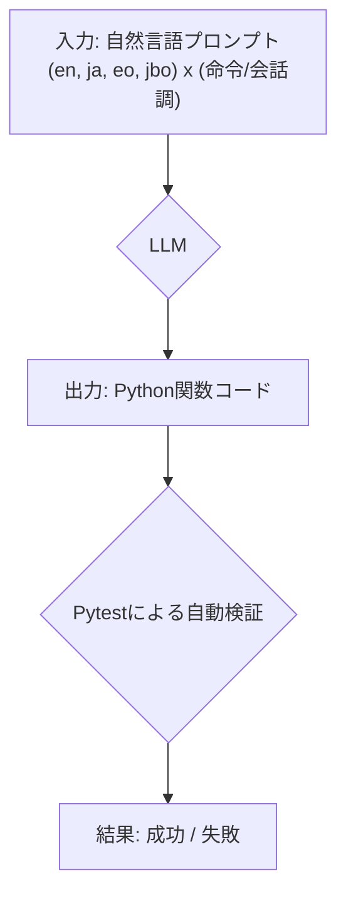
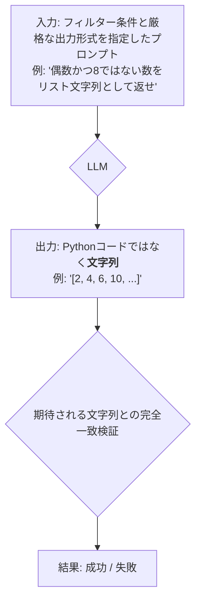
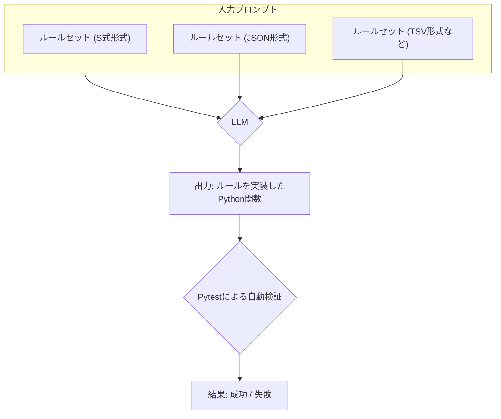
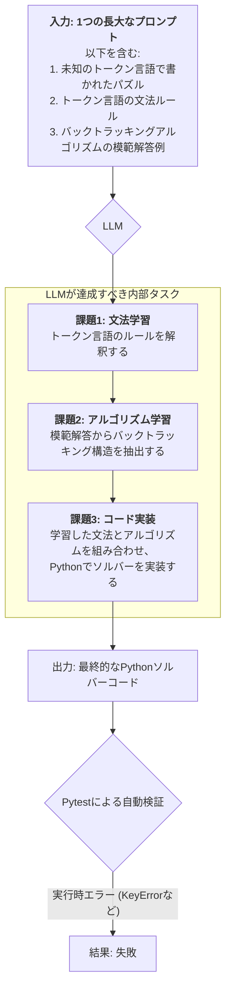

```vega-lite
{
  "$schema": "https://vega.github.io/schema/vega-lite/v5.json",
  "title": "Overall Performance Ranking",
  "height": 500,
  "data": {
    "values": [
      {"モデル": "yi:6b", "総合成功率": "74.42%"},
      {"モデル": "gemma3:4b", "総合成功率": "73.75%"},
      {"モデル": "llama3.2:3b", "総合成功率": "70.42%"},
      {"モデル": "falcon3:3b", "総合成功率": "70.00%"},
      {"モデル": "gemma:7b", "総合成功率": "70.00%"},
      {"モデル": "deepseek-r1:8b", "総合成功率": "68.17%"},
      {"モデル": "llama3:8b", "総合成功率": "67.42%"},
      {"モデル": "mistral:7b", "総合成功率": "52.50%"},
      {"モデル": "llama2:7b", "総合成功率": "45.00%"},
      {"モデル": "deepseek-r1:1.5b", "総合成功率": "40.00%"},
      {"モデル": "deepseek-llm:7b", "総合成功率": "35.00%"},
      {"モデル": "stablelm2:1.6b", "総合成功率": "33.17%"},
      {"モデル": "smollm:360m", "総合成功率": "32.50%"},
      {"モデル": "gemma:2b", "総合成功率": "30.00%"},
      {"モデル": "gemma3:270m", "総合成功率": "27.50%"},
      {"モデル": "tinyllama:1.1b", "総合成功率": "15.00%"},
      {"モデル": "qwen:4b", "総合成功率": "12.50%"},
      {"モデル": "phi3:mini", "総合成功率": "7.50%"},
      {"モデル": "qwen:1.8b", "総合成功率": "5.08%"},
      {"モデル": "qwen:0.5b", "総合成功率": "5.00%"}
    ]
  },
  "transform": [
    {"calculate": "toNumber(replace(datum.総合成功率, '%', '')) / 100", "as": "SuccessRate"}
  ],
  "mark": "bar",
  "encoding": {
    "y": {
      "field": "モデル",
      "type": "nominal",
      "title": "Model",
      "sort": {"op": "sum", "field": "SuccessRate", "order": "descending"}
    },
    "x": {
      "field": "SuccessRate",
      "type": "quantitative",
      "axis": {"format": "%"},
      "title": "Overall Success Rate"
    },
    "tooltip": [
      {"field": "モデル", "type": "nominal", "title": "Model"},
      {"field": "SuccessRate", "type": "quantitative", "format": ".2%"}
    ]
  }
}
```